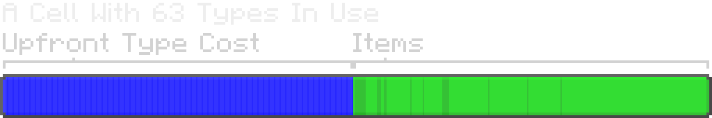

---
navigation:
  parent: ae2-mechanics/ae2-mechanics-index.md
  title: Байты и типы
  icon: item_storage_cell_1k
---

# Байты и типы

<Row>
    <ItemImage id="item_storage_cell_1k" scale="4" />

    <ItemImage id="item_storage_cell_4k" scale="4" />

    <ItemImage id="item_storage_cell_16k" scale="4" />

    <ItemImage id="item_storage_cell_64k" scale="4" />

    <ItemImage id="item_storage_cell_256k" scale="4" />
  </Row>

[Ячейки хранения](../items-blocks-machines/storage_cells.md) определяются *байтами* и *типами*. 
Байты, как и в настоящем компьютере, являются мерой общего количества "материала" в ячейке памяти. 
Типы - это мера того, сколько различных *типов* вещей, хранящихся в ячейке. 
Каждый тип представляет собой уникальный предмет, поэтому 4096 булыжников - это один тип, а 16 различных мечей с разными чарами - это второй тип.

Каждая ячейка памяти может хранить фиксированное количество
данных. Каждый тип предварительно потребляет определенное количество байт (которое зависит от размера ячейки), а каждый элемент - один бит памяти, поэтому восемь элементов потребляют один бит памяти,
а полный стак из 64 элементов - 8 байт, независимо от того, как элемент будет уложен вне МЭ сети
Например, 64 одинаковых седла не
занимают больше места, чем 64 камня.

Опять же, каждый элемент - это 1 бит, поэтому 8 элементов равны 1 байту. Для жидкостных ячеек это 8 ведер в байте.

Многие жалуются на ограниченное количество типов, которые может содержать ячейка, но они ***вынужденно ограничены***.
Ячейки хранят свои данные в NBT-метке на самом элементе, что делает их достаточно стабильными. Однако это означает, что слишком большое количество
данных на ячейку может привести к тому, что игроку будет отправлено слишком много данных, что вызовет эффект, похожий на "Запрет книги" в ванильном minecraft.
Кроме того, наличие в системе слишком большого количества различных типов увеличивает нагрузку на сортировку и обработку элементов. Однако это
ограничение в итоге оказывается не очень жестким. Один отсек <ItemLink id="drive" /> заполненный ячейками, имеет 630 типов, что на самом деле
достаточно много, если не хранить много уникальных нестакаемых предметов.

По этой причине существуют типы, которые "решительно не позволяют" вам сбрасывать сотни случайно поврежденных доспехов и инструментов из
 фермы мобов прямо в МЭ систему. Каждый предмет брони с уникальными повреждениями и зачарованиями должен храниться как отдельная запись.
Рекомендуется отфильтровывать их из потока предметов до того, как они попадут в систему.

Стремиться сразу к ячейкам хранения высшего уровня, как правило, не самая лучшая идея,
так как вы используете больше ресурсов, но не получаете никакого дополнительного типа хранилища. Это означает, что ячейки всех размеров полезны даже
 в поздней игре, поскольку они имеют свои преимущества.

Ниже приведена таблица, в которой сравниваются различные уровни ячеек памяти, их объем и приблизительная стоимость.

## Содержание ячейки памяти в зависимости от стоимости

| Cell                                     |   Байты | Типы  | Байт на тип    | Кварц  | Редстоун | Золото | Светопыль |
| ---------------------------------------- | ------: | ----: | -------------: | -----: | -------: | ---:   | --------: |
| <ItemLink id="item_storage_cell_1k" />   |   1,024 |    63 |              8 |      4 |        5 |    1   |         0 |
| <ItemLink id="item_storage_cell_4k" />   |   4,096 |    63 |             32 |  14.25 |       20 |    3   |         0 |
| <ItemLink id="item_storage_cell_16k" />  |  16,384 |    63 |            128 |     45 |       61 |    9   |         4 |
| <ItemLink id="item_storage_cell_64k" />  |  65,536 |    63 |            512 | 137.25 |      184 |   27   |        16 |
| <ItemLink id="item_storage_cell_256k" /> | 262,144 |    63 |           2048 |    414 |      553 |   81   |        48 |

## Емкость хранилища при различном количестве типов

Первоначальная стоимость типов такова, что ячейка, содержащая 1 тип, может вместить в 2 раза больше, чем ячейка, в которой используются все 63 типа.

| Ячейка                                   | Общая емкость ячейки при использовании 1 типа | Общая емкость ячейки с 63 используемыми типами |
| ---------------------------------------- | --------------------------------------------: | ---------------------------------------------: |
| <ItemLink id="item_storage_cell_1k" />   |                                        8,128  |                                         4,160  |
| <ItemLink id="item_storage_cell_4k" />   |                                       32,512  |                                        16,640  |
| <ItemLink id="item_storage_cell_16k" />  |                                      130,048  |                                        66,560  |
| <ItemLink id="item_storage_cell_64k" />  |                                      520,192  |                                       266,240  |
| <ItemLink id="item_storage_cell_256k" /> |                                    2,080,768  |                                     1,064,960  |

