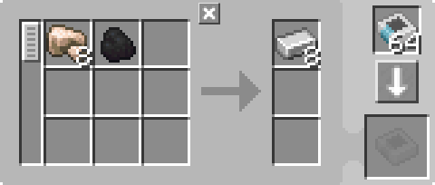

---
navigation:
  parent: example-setups/example-setups-index.md
  title: Автоматизация печи
  icon: minecraft:furnace
---

# Автоматизация печи

Автоматизация <ItemLink id="minecraft:furnace" /> несколько сложнее, чем автоматизация более простых механизмов, таких как [зарядник](../example-setups/charger-automation.md).
Печь требует ввода с двух сторон и извлечения с третьей. Предмет, подлежащий плавке, должен быть вставлен с верхней стороны,
топливо - в боковую сторону, а результат - в нижнюю. 

Для этого можно использовать <ItemLink id="pattern_provider" />
в верхней части, <ItemLink id="export_bus" /> в боковой части для постоянной подачи топлива, и <ItemLink id="import_bus" /> 
в нижней части для импорта результатов в сеть. Однако при этом используется 3 [канала](../ae2-mechanics/channels.md).

Вот как это можно сделать, используя только 1 канал:

<GameScene zoom="6" interactive={true}>
  <ImportStructure src="../assets/assemblies/furnace_automation.snbt" />

<BoxAnnotation color="#dddddd" min="1 0 0" max="2 1 1">
        (1) МЭ Интерфейс: Направленный вариант, с использованием ключа из истинного кварца, с соответствующими шаблонами обработки.

        
  </BoxAnnotation>

<BoxAnnotation color="#dddddd" min="1 1 0" max="2 1.3 1">
        (2) Интерфейс: В конфигурации по умолчанию.
  </BoxAnnotation>

<BoxAnnotation color="#dddddd" min="1 1 0" max="1.3 2 1">
        (3) Шина хранения №1: Фильтруется на уголь.
        <ItemImage id="minecraft:coal" scale="2" />
  </BoxAnnotation>

<BoxAnnotation color="#dddddd" min="0 2 0" max="1 2.3 1">
        (4) Шина хранения # 2: Фильтруется для внесения угля в черный список, используется инверторная плата.
        <Row><ItemImage id="minecraft:coal" scale="2" /><ItemImage id="inverter_card" scale="2" /></Row>
  </BoxAnnotation>

<DiamondAnnotation pos="4 0.5 0.5" color="#00ff00">
        К основной сети
    </DiamondAnnotation>

  <IsometricCamera yaw="195" pitch="30" />
</GameScene>

## Конфигурации

*В конфигурации по умолчанию <ItemLink id="pattern_provider" /> (1) указаны соответствующие <ItemLink id="processing_pattern" />.
    Он сделан направленным, если использовать на нем <ItemLink id="certus_quartz_wrench" />.

  

* <ItemLink id="interface" /> (2) находится в конфигурации по умолчанию.
* Первая <ItemLink id="storage_bus" /> (3) фильтруется на уголь или любое другое топливо, которое вы хотите использовать.
* Вторая <ItemLink id="storage_bus" /> (4) фильтруется, чтобы внести используемое топливо в черный список, используя <ItemLink id="inverter_card" />.

## Как это работает

1. Поставщик <ItemLink id="pattern_provider" /> проталкивает компоненты в <ItemLink id="interface" />.
   (На самом деле, в качестве оптимизации, он проталкивает элементы непосредственно через шины хранения, как если бы они были продолжением лица интерфейса. На самом деле элементы никогда не попадают в интерфейс).
2. Интерфейс настроен на хранение ничего, поэтому он пытается затолкать ингредиенты в [хранилище сети](../ae2-mechanics/import-export-storage.md).
3. Единственным хранилищем в зеленой подсети является <ItemLink id="storage_bus" />. Шина, отфильтрованная на уголь, помещает уголь в топливную щель печи через боковую поверхность.
    Шина, отфильтрованная на НЕ уголь, помещает предметы, подлежащие плавке, в верхний слот, через верхний торец.
4. Печь выполняет свою работу.
5. Воронка извлекает результаты из нижней части печи и помещает их в слоты возврата интерфейса, возвращая их в основную сеть.
