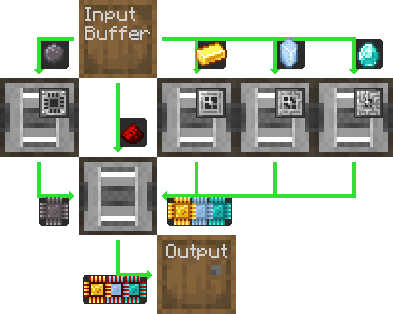
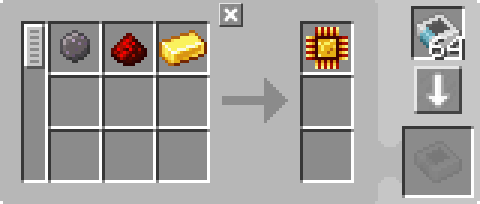
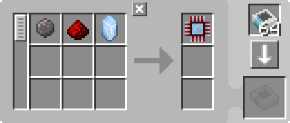
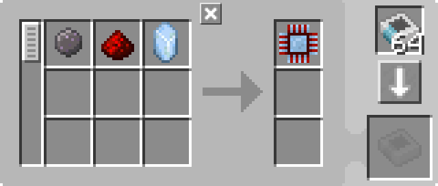
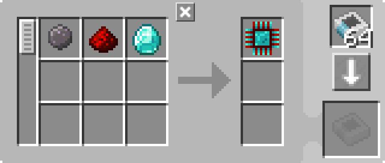

---
navigation:
  parent: example-setups/example-setups-index.md
  title: Автоматизация процессоров
  icon: inscriber
---

# Автоматизация производства процессоров

Существует множество способов автоматизации крафта [процессоров](../items-blocks-machines/processors.md), и это один из них.

Эта общая схема может быть выполнена с любым типом элемента логистики трубы или канала, или как там его называет мод,
если вы можете его фильтровать.

Здесь подробно описано, как это сделать с помощью AE2, используя ["трубы" подсетей](pipe-subnet.md).

Это совместимо
с предыдущими версиями AE2, поскольку даже если <ItemLink id="inscriber" /> являются односторонними, трубные подсети все равно вставляются в правильные грани и
извлекаются из нужной стороны.

<GameScene zoom="4" interactive={true}>
  <ImportStructure src="../assets/assemblies/processor_automation.snbt" />

  <BoxAnnotation color="#dddddd" min="5 1 0" max="6 2 1" thickness=".05">
        (1) МЭ Интерфейс: В конфигурации по умолчанию, с соответствующими шаблонами обработки.

        <Row>
            
            
            
        </Row>
  </BoxAnnotation>

  <BoxAnnotation color="#dddddd" min="4.7 2 0" max="5 3 1" thickness=".05">
        (2) Шина хранения #1: В конфигурации по умолчанию.
  </BoxAnnotation>

  <BoxAnnotation color="#dddddd" min="4 1 0" max="4.3 2 1" thickness=".05">
        (3) Шина экспорта #1: Отфильтрована до кремния, имеет 2 карты ускорения
        <Row><ItemImage id="silicon" scale="2" /> <ItemImage id="speed_card" scale="2" /></Row>
  </BoxAnnotation>

  <BoxAnnotation color="#dddddd" min="4 4 0" max="4.3 3 1" thickness=".05">
        (4) Шина экспорта # 2: Отфильтрована до золотых самородков, имеет 2 карты ускорения.
        <Row><ItemImage id="minecraft:gold_ingot" scale="2" /> <ItemImage id="speed_card" scale="2" /></Row>
  </BoxAnnotation>

  <BoxAnnotation color="#dddddd" min="4 5 0" max="4.3 4 1" thickness=".05">
        (5) Шина экспорта #3: Отфильтрована до кристалла истинного кварца, имеет 2 карты ускор
        <Row><ItemImage id="certus_quartz_crystal" scale="2" /> <ItemImage id="speed_card" scale="2" /></Row>
  </BoxAnnotation>

  <BoxAnnotation color="#dddddd" min="4 6 0" max="4.3 5 1" thickness=".05">
        (6) Шина экспорта #3: Отфильтрована до кристалла истинного кварца, имеет 2 карты ускорения
        <Row><ItemImage id="minecraft:diamond" scale="2" /> <ItemImage id="speed_card" scale="2" /></Row>
  </BoxAnnotation>

  <BoxAnnotation color="#dddddd" min="2.3 3 0" max="2 2 1" thickness=".05">
        (7) Шина экспорта #5: Отфильтрована до редстоуна, имеет 2 карты ускорения
        <Row><ItemImage id="minecraft:redstone" scale="2" /> <ItemImage id="speed_card" scale="2" /></Row>
  </BoxAnnotation>

  <BoxAnnotation color="#dddddd" min="4 1 0" max="3 2 1" thickness=".05">
        (8) Высекатель #1: В конфигурации по умолчанию. Имеет кремниевый пресс и 4 карты ускорения
        <Row><ItemImage id="silicon_press" scale="2" /> <ItemImage id="speed_card" scale="2" /></Row>
  </BoxAnnotation>

  <BoxAnnotation color="#dddddd" min="4 3 0" max="3 4 1" thickness=".05">
        (9) Высекатель #2: В конфигурации по умолчанию. Имеет логический пресс и 4 карты ускорения
        <Row><ItemImage id="logic_processor_press" scale="2" /> <ItemImage id="speed_card" scale="2" /></Row>
  </BoxAnnotation>

  <BoxAnnotation color="#dddddd" min="4 4 0" max="3 5 1" thickness=".05">
        (10) Высекатель #3: В конфигурации по умолчанию. Имеет вычислительный пресс и 4 ускорительные карты
        <Row><ItemImage id="calculation_processor_press" scale="2" /> <ItemImage id="speed_card" scale="2" /></Row>
  </BoxAnnotation>

  <BoxAnnotation color="#dddddd" min="4 5 0" max="3 6 1" thickness=".05">
        (11) Высекатель #4: В конфигурации по умолчанию. Имеет инженерный пресс и 4 карты ускорения
        <Row><ItemImage id="engineering_processor_press" scale="2" /> <ItemImage id="speed_card" scale="2" /></Row>
  </BoxAnnotation>

  <BoxAnnotation color="#dddddd" min="2 2 0" max="1 3 1" thickness=".05">
        (12) Высекатель #5: В конфигурации по умолчанию. Имеет 4 карты ускорения
        <ItemImage id="speed_card" scale="2" />
  </BoxAnnotation>

  <BoxAnnotation color="#dddddd" min="2.7 2 0" max="3 1 1" thickness=".05">
        (13) Шина импорта #1: В конфигурации по умолчанию имеет 2 карты ускорения
        <ItemImage id="speed_card" scale="2" />
  </BoxAnnotation>

  <BoxAnnotation color="#dddddd" min="2.7 4 0" max="3 3 1" thickness=".05">
        (14) Шина импорта #2: В конфигурации по умолчанию имеет 2 карты ускорения
        <ItemImage id="speed_card" scale="2" />
  </BoxAnnotation>

  <BoxAnnotation color="#dddddd" min="2.7 5 0" max="3 4 1" thickness=".05">
        (15) Шина импорта #3: В конфигурации по умолчанию имеет 2 карты ускорения
        <ItemImage id="speed_card" scale="2" />
  </BoxAnnotation>

  <BoxAnnotation color="#dddddd" min="2.7 6 0" max="3 5 1" thickness=".05">
        (16) Шина импорта #4: В конфигурации по умолчанию имеет 2 карты ускорения
        <ItemImage id="speed_card" scale="2" />
  </BoxAnnotation>

  <BoxAnnotation color="#dddddd" min="2 3 0" max="1 3.3 1" thickness=".05">
        (17) Шина хранения #2: В конфигурации по умолчанию.
  </BoxAnnotation>

  <BoxAnnotation color="#dddddd" min="2 1.7 0" max="1 2 1" thickness=".05">
        (18) Шина хранения #3: В конфигурации по умолчанию.
  </BoxAnnotation>

  <BoxAnnotation color="#dddddd" min="1 2 0" max="0.7 3 1" thickness=".05">
        (19) Шина импорта #5: В конфигурации по умолчанию имеет 2 карты ускорения
        <ItemImage id="speed_card" scale="2" />
  </BoxAnnotation>

  <BoxAnnotation color="#dddddd" min="5 0.7 0" max="6 1 1" thickness=".05">
        (20) Шина хранения #4: В конфигурации по умолчанию.
  </BoxAnnotation>

<BoxAnnotation color="#dddddd" min="3.3 2.7 0.3" max="3.7 3 0.7" thickness=".05">
        Кварцевое волокно питает все 3 высекателя, поскольку они действуют как кабели и таким образом передают энергию
  </BoxAnnotation>

<DiamondAnnotation pos="7 1.5 0.5" color="#00ff00">
        К основной сети
    </DiamondAnnotation>

  <IsometricCamera yaw="185" pitch="5" />
</GameScene>

## Конфигурации

* <ItemLink id="pattern_provider" /> (1) находится в конфигурации по умолчанию, с соответствующим <ItemLink id="processing_pattern" />.

  
  
  

* <ItemLink id="storage_bus" /> (2, 17, 18, 20) находятся в конфигурации по умолчанию.
* Пункты <ItemLink id="export_bus" /> (3-7) отфильтрованы по соответствующему ингредиенту. Они имеют 2 <ItemLink id="speed_card" />.

    <Row>
      <ItemImage id="silicon" scale="2" />
      <ItemImage id="minecraft:gold_ingot" scale="2" />
      <ItemImage id="certus_quartz_crystal" scale="2" />
      <ItemImage id="minecraft:diamond" scale="2" />
      <ItemImage id="minecraft:redstone" scale="2" />
    </Row>
* <ItemLink id="import_bus" /> (13-16, 19) находятся в конфигурациях по умолчанию. Они имеют 2 <ItemLink id="speed_card" />.
* <ItemLink id="inscriber" /> находятся в конфигурациях по умолчанию. Они имеют соответствующие [прессы](../items-blocks-machines/presses.md),
   и 4 <ItemLink id="speed_card" />.
   <Row>
     <ItemImage id="silicon_press" scale="2" />
     <ItemImage id="logic_processor_press" scale="2" />
     <ItemImage id="calculation_processor_press" scale="2" />
     <ItemImage id="engineering_processor_press" scale="2" />
   </Row>

## Как это работает

1. Устройство <ItemLink id="pattern_provider" /> заталкивает ингредиенты в бочку.
2. Первые [трубы подсети](pipe-subnet.md) (оранжевый) извлекает кремний, редстоун и соответствующий ингредиент процессора
   (золотой слиток, ристалл истинного кварца или алмаз) из бочки и помещает их в соответствующий <ItemLink id="inscriber" />.
3. Первые четыре <ItemLink id="inscriber" /> делают <ItemLink id="printed_silicon" />, а <ItemLink id="printed_logic_processor" />,
   <ItemLink id="printed_calculation_processor" />, или <ItemLink id="printed_engineering_processor" />.
4. Во вторых и третьих [трубах подсети](pipe-subnet.md) (зеленые) печатные схемы берутся из первых четырех <ItemLink id="inscriber" />
    и помещают их в пятую, окончательную сборку <ItemLink id="inscriber" />.
5. Пятый <ItemLink id="inscriber" /> собирает [процессор](../items-blocks-machines/processors.md).
6. Четвертые [трубы подсети](pipe-subnet.md) (фиолетовый) помещает процессор в интерфейс шаблонов, возвращая его в основную сеть.