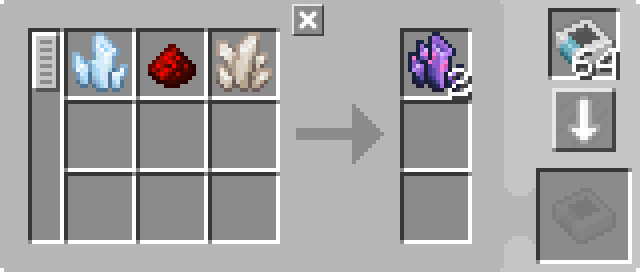

---
navigation:
  parent: example-setups/example-setups-index.md
  title: Автоматизация бросков в воду
  icon: fluix_crystal
---

# Автоматизация бросания в воду

В некоторых рецептах требуется бросать предметы в воду (хотя аналогичная установка может быть использована и для бросания предметов в другие места).
Это можно автоматизировать с помощью <ItemLink id="formation_plane" />, <ItemLink id="annihilation_plane" /> и некоторой вспомогательной
инфраструктуры (по сути, это 2 модифицированные [подсети](pipe-subnet.md)).

Эта установка предназначена для использования в сочетании с [автоматизацией зарядника](charger-automation.md) для обеспечения <ItemLink id="charged_certus_quartz_crystal" />.

<GameScene zoom="6" interactive={true}>
  <ImportStructure src="../assets/assemblies/throw_in_water.snbt" />

<BoxAnnotation color="#dddddd" min="2 0 1" max="3 1 2">
        (1) МЭ Интерфейс: В конфигурации по умолчанию, с соответствующими шаблонами обработки.

         
  </BoxAnnotation>

<BoxAnnotation color="#dddddd" min="1.7 0 1" max="2 1 2">
        (2) Интерфейс: В конфигурации по умолчанию.
  </BoxAnnotation>

<BoxAnnotation color="#dddddd" min="1 .7 1" max="2 1 2">
        (3) Плоскость формирования: Установите сброс входов в виде предметов.
  </BoxAnnotation>

<BoxAnnotation color="#dddddd" min="1 2 1" max="2 2.3 2">
        (4) Плоскость уничтожения: Отсутствие графического интерфейса для настройки.
  </BoxAnnotation>

<BoxAnnotation color="#dddddd" min="2 1 1" max="3 1.3 2">
        (5) Шина хранения: Фильтруется к выходам деталей
        <Row><ItemImage id="fluix_crystal" scale="2" /><BlockImage id="flawless_budding_quartz" scale="2" /></Row>
  </BoxAnnotation>

<DiamondAnnotation pos="3.9 0.5 1.5" color="#00ff00">
        К основной сети и заряднику
        <GameScene zoom="3" background="transparent">
          <ImportStructure src="../assets/assemblies/charger_automation.snbt" />
          <IsometricCamera yaw="195" pitch="30" />
        </GameScene>
    </DiamondAnnotation>

  <IsometricCamera yaw="180" pitch="0" />
</GameScene>

## Конфигурации и шаблоны

* <ItemLink id="pattern_provider" /> (1) находится в конфигурации по умолчанию, с соответствующими <ItemLink id="processing_pattern" />
  * Для <ItemLink id="fluix_crystal" /> прекрасно работает стандартный рецепт от JEI/REI:

    

  * Для <ItemLink id="flawed_budding_quartz" />, вероятно, лучше сделать его непосредственно из <ItemLink id="quartz_block" />,
    что позволит избежать проблем с тем, что вход одного рецепта будет выходом другого, в результате чего шина хранения не сможет фильтровать:

    

* <ItemLink id="interface" /> (2) находится в конфигурации по умолчанию.
* <ItemLink id="formation_plane" /> (3) настроена на сброс предметов в качестве элементов.
* <ItemLink id="annihilation_plane" /> (4) не имеет графического интерфейса и не может быть настроена.
* <ItemLink id="storage_bus" /> (5) фильтруется на выходы предметов.

## Как это работает

1.  <ItemLink id="pattern_provider" /> проталкивает ингредиенты в <ItemLink id="interface" /> на своей стороне, в зеленой подсети.
2.  Интерфейс (по умолчанию настроенный на то, чтобы ничего не хранить) пытается переместить свое содержимое в [хранилище сети](../ae2-mechanics/import-export-storage.md)
3.  Единственным хранилищем в зеленой подсети является <ItemLink id="formation_plane" />, которая сбрасывает полученные предметы в воду
4.  Хранилище <ItemLink id="annihilation_plane" /> в оранжевой подсети пытается забрать только что сброшенные предметы, но не может, так как
    <ItemLink id="storage_bus" /> на вершине поставщика шаблонов (единственное хранилище в оранжевой подсети) отфильтровано так, чтобы принимать только результаты возможных крафтов
5.  Предметы выполняют свое преобразование в мире.
6.  Плоскость уничтожения теперь может забирать предметы, находящиеся перед ней, так как шине хранения разрешено их хранить.
7.  Шина хранения сохраняет полученные предметы в поставщике шаблонов и возвращает их в сеть.