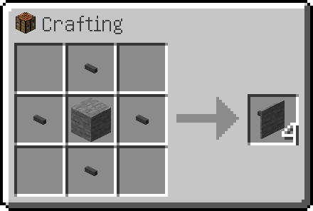

---
navigation:
  parent: items-blocks-machines/items-blocks-machines-index.md
  title: Фасады
  icon: facade
  position: 110
categories:
- network infrastructure
item_ids:
- ae2:facade
---

# Фасады

Фасады могут использоваться для придания базе более аккуратного вида. Они могут закрывать кабель обоих размеров и изготавливаться из различных
видов блоков.

<GameScene zoom="6" background="transparent">
  <ImportStructure src="../assets/assemblies/facades_1.snbt" />
  <IsometricCamera yaw="195" pitch="30" />
</GameScene>

Они могут закрывать все стороны кабеля, но при этом [подчасти](../ae2-mechanics/cable-subparts.md) и кабельные соединения будут выступать.

<GameScene zoom="6"  interactive={true}>
  <ImportStructure src="../assets/assemblies/facades_2.snbt" />
  <IsometricCamera yaw="195" pitch="30" />
</GameScene>

Используйте их с умом, чтобы улучшить эстетику базы или сделать блоки с разной текстурой на каждой стороне.

<GameScene zoom="4" interactive={true}>
  <ImportStructure src="../assets/assemblies/facades_3.snbt" />
  <IsometricCamera yaw="195" pitch="30" />
</GameScene>

## Рецепт

Поместите блок, текстура которого вам нужна, в центр 4 <ItemLink id="cable_anchor" />.

