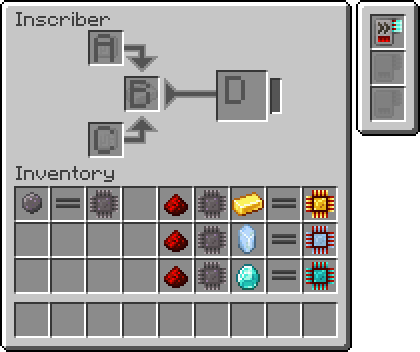
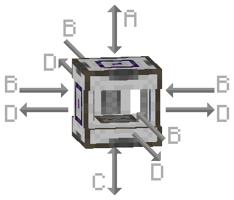

---
navigation:
  parent: items-blocks-machines/items-blocks-machines-index.md
  title: Высекатель
  icon: inscriber
  position: 310
categories:
- machines
item_ids:
- ae2:inscriber
---

# Высекатель

<BlockImage id="inscriber" scale="8" />

Высекатель используется для надписи схем и [процесооров](processors.md) с помощью [прессов](presses.md), а также для измельчения различных предметов в пыль.
Он может принимать либо энергию AE2 (AE), либо энергию Fabric/Forge (E/FE). Он может быть двусторонним, так что при вставке предметов с разных сторон они
вставляются в разные слоты инвентаря. Для этого его можно поворачивать с помощью <ItemLink id="certus_quartz_wrench" />.
Он также может быть настроен на перемещение результатов крафта в соседние инвентари.

Для изготовления [процессоров](processors.md) используются 4 пресса.

<Row>
  <ItemImage id="silicon_press" scale="4" />

  <ItemImage id="logic_processor_press" scale="4" />

  <ItemImage id="calculation_processor_press" scale="4" />

  <ItemImage id="engineering_processor_press" scale="4" />
</Row>

В то время как печатный пресс может использоваться для наименования блоков подобно наковальне, что полезно для маркировки вещей в <ItemLink id="pattern_access_terminal" />.

<ItemImage id="name_press" scale="4" />

## Настройки

* Высекатель может быть настроен на боковой режим (как объясняется ниже) или разрешать вход в любой слот с любой стороны, при этом внутренний фильтр определяет,
    что куда входит. В режиме работы без бокового входа предметы не могут быть извлечены из верхнего и нижнего слотов.
* Высекатель может быть настроен на выталкивание предметов в соседние хранилища.

## Графический интерфейс и односторонность

В одностороннем режиме высекатель фильтрует, что куда попадает, по тому, с какой стороны вы вставляете или извлекаете.

 

A. **Верхний вход**, доступ к которому осуществляется через верхнюю часть высекателя (предметы можно как заталкивать в этот разъем, так и вытаскивать из него)

B. **Центральный вход**, доступ к которому осуществляется через левую, правую, переднюю и заднюю стороны высекателя (предметы можно только подносить к этому слоту, но не вытаскивать из него)

C. **Нижний вход**, доступ к которому осуществляется через нижнюю сторону высекателя (предметы можно как подносить к этому слоту, так и вытаскивать из него)

D. **Выход**, доступ к которому осуществляется с левой, правой, передней и задней сторон высекателя (предметы можно только вытаскивать из этого слота, но не толкать к нему)

## Простая автоматизация

В качестве примера можно привести полуавтоматизацию высекателей, благодаря наличию сторон и возможности поворота:

<GameScene zoom="4" background="transparent">
  <ImportStructure src="../assets/assemblies/inscriber_hopper_automation.snbt" />
  <IsometricCamera yaw="195" pitch="30" />
</GameScene>

Или просто вводить и выводить трубы из высекателя в режиме работы без бокового подключения.

## Улучшения

Высекатель поддерживает следующие [улучшения](upgrade_cards.md):

*   <ItemLink id="speed_card" />

## Рецепты

<RecipeFor id="inscriber" />
