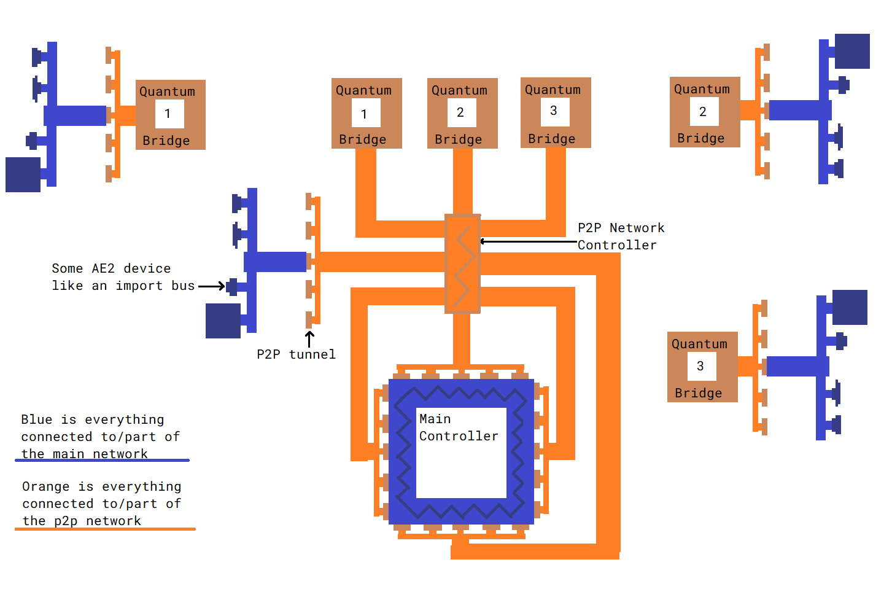

---
navigation:
  parent: items-blocks-machines/items-blocks-machines-index.md
  title: P2P туннели
  icon: me_p2p_tunnel
  position: 210
categories:
- devices
item_ids:
- ae2:me_p2p_tunnel
- ae2:redstone_p2p_tunnel
- ae2:item_p2p_tunnel
- ae2:fluid_p2p_tunnel
- ae2:fe_p2p_tunnel
- ae2:light_p2p_tunnel
---

# P2P туннели

<GameScene zoom="6" background="transparent">
  <ImportStructure src="../assets/assemblies/p2p_tunnels.snbt" />
  <IsometricCamera yaw="195" pitch="30" />
</GameScene>

P2P туннели - это способ перемещения предметов, жидкостей, сигналов редстоуна, энергии, света и [каналов](../ae2-mechanics/channels.md)
по сети без их непосредственного взаимодействия с сетью. Существует множество вариантов туннелей P2P,
но каждый из них обеспечивает передачу только своего конкретного типа данных. По сути, они действуют как порталы, напрямую соединяющие
два блокчейна на расстоянии. Они не являются двунаправленными, у них есть определенные входы и выходы.

Например, воронка, обращенный к объекту P2P, будет вести себя так, как будто он напрямую соединен с бочкой, и предметы будут поступать.

<GameScene zoom="4" background="transparent">
  <ImportStructure src="../assets/assemblies/p2p_hopper_barrel.snbt" />
  <IsometricCamera yaw="195" pitch="30" />
</GameScene>

Однако две бочки, расположенные рядом друг с другом, не будут передавать предметы друг другу.

<GameScene zoom="4" background="transparent">
  <ImportStructure src="../assets/assemblies/p2p_barrel_barrel.snbt" />
  <IsometricCamera yaw="195" pitch="30" />
</GameScene>

Существуют также другие варианты, подобные Редстоун P2P.

<GameScene zoom="4" background="transparent">
  <ImportStructure src="../assets/assemblies/p2p_redstone.snbt" />
  <IsometricCamera yaw="195" pitch="30" />
</GameScene>

## Типы P2P-туннелей и настроек

<GameScene zoom="6" background="transparent">
  <ImportStructure src="../assets/assemblies/p2p_tunnels.snbt" />
  <IsometricCamera yaw="180" pitch="90" />
</GameScene>

Существует множество типов P2P-туннелей. Только P2P-туннель ME можно изготовить напрямую, остальные создаются щелчком правой кнопки мыши по другим P2P-туннелям с помощью определенных предметов.
P2P-туннелей с помощью определенных предметов:
- ME P2P редстуон туннели создаются щелчком правой кнопки мыши с любым [кабелем](../items-blocks-machines/cables.md).
- P2P туннели создаются щелчком правой кнопки мыши с различными компонентами редстоун.
- P2P туннели из предметов создаются щелчком правой кнопки мыши с сундуком или бочкой.
- P2P туннели с жидкостью создаются щелчком правой кнопкой мыши с ведром или пузырьком.
- Энергетические P2P туннели создаются щелчком правой кнопки мыши с практически любом энергосодержащем предметом.
- Световые P2P туннели создаются при нажатии правой кнопкой мыши с факелом или светящимся камнем.

Некоторые типы туннелей имеют свои особенности. Например, каналы туннелей ME P2P не могут проходить через другие туннели ME P2P, и
Энергетические P2P туннели косвенно взимают 5%-ный налог с проходящих через них FE или E, увеличивая своё потребление
[энергии](../ae2-mechanics/energy.md).

## Наиболее часто используемая форма P2P

Наиболее распространенным вариантом использования туннелей P2P является применение туннеля ME P2P для уплотнения плотности транспорта [канала](../ae2-mechanics/channels.md).
Вместо пучка плотных кабелей можно использовать один плотный кабель для передачи множества каналов.

В данном примере 8 входов ME P2P принимают 256 каналов (8*32) от <ItemLink id="controller" /> основной сети, а 8 выходов ME P2P 
выводят их в другое место. Обратите внимание, что каждый вход или выход туннеля P2P занимает 1 канал. Таким образом, мы можем пропустить множество каналов 
по тонкому кабелю. А поскольку наши P2P туннели находятся в выделенной [подсети](../ae2-mechanics/subnetworks.md), то мы даже не
используем для этого каналы основной сети! Также обратите внимание, что если P2P туннели могут быть размещены непосредственно
против контроллера, между ними можно разместить [плотные умные кабеля](../items-blocks-machines/cables.md#smart-cable) для более удобной визуализации каналов.

<GameScene zoom="4" interactive={true}>
  <ImportStructure src="../assets/assemblies/p2p_compact_channels.snbt" />

  <BoxAnnotation color="#dddddd" min="1.3 1.3 6.3" max="2 2.7 6.7">
        Кварцевое волокно разделяет энергию между основной сетью и подсетью p2p
  </BoxAnnotation>

  <IsometricCamera yaw="225" pitch="30" />
</GameScene>

Другой пример (включая его использование с [Квантовым мостом](quantum_bridge.md)) приведен на этой диаграмме.

## Вложенность

Однако с его помощью нельзя передавать бесконечное количество каналов по одному кабелю. Канал для туннеля ME P2P не будет
не будет проходить через другой туннель ME P2P, поэтому их нельзя рекурсивно вложить друг в друга. Обратите внимание, что внешний слой туннелей ME P2P на красных кабелях отключен.
на красных кабелях отключен. Обратите внимание, что это относится только к туннелям ME P2P, другие типы туннелей P2P могут проходить через туннель ME P2P,
как видно из того, что P2P редстоун туннели работают нормально.

<GameScene zoom="4" background="transparent">
  <ImportStructure src="../assets/assemblies/p2p_nesting.snbt" />
  <IsometricCamera yaw="225" pitch="30" />
</GameScene>

## Связь

<GameScene zoom="6" background="transparent">
  <ImportStructure src="../assets/assemblies/p2p_linking_frequency.snbt" />
  <IsometricCamera yaw="195" pitch="30" />
</GameScene>

Концы туннельного P2P-соединения могут быть связаны с помощью <ItemLink id="memory_card" />. Частота будет отображаться
в виде массива цветов 2x2 на обратной стороне туннеля.
- Щелкните правой кнопкой мыши, чтобы сгенерировать новую частоту P2P-соединения.
- Щелкните правой кнопкой мыши, чтобы вставить настройки, карты обновления или частоту линковки.

Туннель, на котором вы щелкнули правой кнопкой мыши, будет входом, а туннель, на котором вы щелкнули правой кнопкой мыши, - выходом. Вы можете иметь несколько выходов,
но при использовании туннелей ME P2P каналы, поступающие на вход, будут распределяться между выходами, поэтому дублировать каналы нельзя.

## Рецепт

<RecipeFor id="me_p2p_tunnel" />