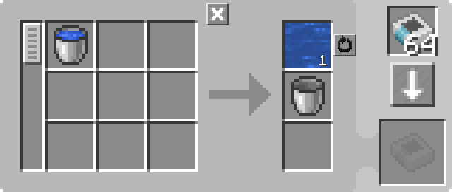
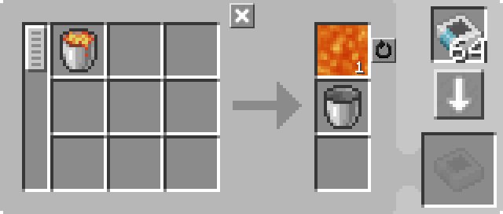

---
navigation:
  parent: example-setups/example-setups-index.md
  title: Опорожнитель вёдер
  icon: minecraft:bucket
---

# Опорожнитель вёдер

См. также [наполнитель вёдер](ae2guide/ae2guide_orig/example-setups/bucket-filler.md).

Заметьте, что поскольку здесь используется <ItemLink id="pattern_provider" />, эта установка предназначена для интеграции в вашу систему [автосоздания](../ae2-mechanics/autocrafting.md).

Жизнь бывает неудобна, и вам нужна сама жидкость, но вы можете получить её только в ведре. Иногда механизм может сделать это за вас (например, жидкостный преобразователь из Thermal Expansion), но не всегда у вас есть мод, который сделает это удобно. К счастью, в ванильном Майнкрафте есть чуть менее удобный способ — <ItemLink id="minecraft:dispenser" />.

<GameScene zoom="6" interactive={true}>
  <ImportStructure src="../assets/assemblies/bucket_emptier.snbt" />

<BoxAnnotation color="#dddddd" min="2 1 0" max="3 2 1">
        (1) Поставщик шаблонов: настроен на блокировку создания «При наличии редстоун-сигнала» и включён режим блокирования, с соответствующими шаблонами обработки.

        <Row>
        
        
        </Row>
  </BoxAnnotation>

<BoxAnnotation color="#dddddd" min="2.1 2 0.1" max="2.9 2.2 0.9">
        (2) Интерфейс: в конфигурации по умолчанию.
  </BoxAnnotation>

<BoxAnnotation color="#dddddd" min="3.1 2 1.1" max="3.9 2.2 1.9">
        (3) Шина хранения №1: в конфигурации по умолчанию.
  </BoxAnnotation>

<BoxAnnotation color="#dddddd" min="4.05 1.05 0.8" max="4.95 1.95 1">
        (4) Плоскость уничтожения: нет меню для настройки.
  </BoxAnnotation>

<BoxAnnotation color="#dddddd" min="3.2 1.2 0.8" max="3.8 1.8 1">
        (5) Шина импортирования: отфильтрована на вёдра.
        <ItemImage id="minecraft:bucket" scale="2" />
  </BoxAnnotation>

<BoxAnnotation color="#dddddd" min="3 1.1 0.1" max="3.2 1.9 0.9">
        (6) Шина хранения №2: в конфигурации по умолчанию.
  </BoxAnnotation>

<DiamondAnnotation pos="0 1.5 0.5" color="#00ff00">
        Идёт в основную сеть
    </DiamondAnnotation>

  <IsometricCamera yaw="225" pitch="45" />
</GameScene>

## Конфигурации

* <ItemLink id="pattern_provider" /> (1) настроен на блокировку создания «При наличии редстоун-сигнала» и включён режим блокирования, с соответствующими <ItemLink id="processing_pattern" />.

    
    

* <ItemLink id="interface" /> (2) в конфигурации по умолчанию.
* Первая <ItemLink id="storage_bus" /> (3) в конфигурации по умолчанию.
* <ItemLink id="annihilation_plane" /> (4) не имеет меню для настройки.
* <ItemLink id="import_bus" /> (5) отфильтрована на вёдра.
  <ItemImage id="minecraft:bucket" scale="2" />
* Вторая <ItemLink id="storage_bus" /> (6) в конфигурации по умолчанию.

## Как это работает

1. <ItemLink id="pattern_provider" /> подаёт ингредиенты в <ItemLink id="interface" />. (На самом деле, для оптимизации он подаёт их напрямую через шину хранения, как будто она является продолжением граней поставщика. Предметы никогда не попадают в интерфейс.)
2. Через механизмы, описанные в [подсетях-«трубах»](pipe-subnet.md#подача-в-несколько-мест), ведро оказывается в <ItemLink id="minecraft:dispenser" />.
3. <ItemLink id="minecraft:comparator" /> обнаруживает ведро в раздатчике и одновременно запитывает раздатчик и блокирует <ItemLink id="pattern_provider" />.
4. Раздатчик выливает жидкость из ведра, теперь в нём находится пустое ведро.
5. <ItemLink id="import_bus" /> извлекает пустое ведро из раздатчика и сохраняет его через <ItemLink id="storage_bus" /> в поставщик шаблонов, возвращая его в основную сеть.
6. Компаратор видит, что раздатчик пуст, и разблокировывает поставщик.