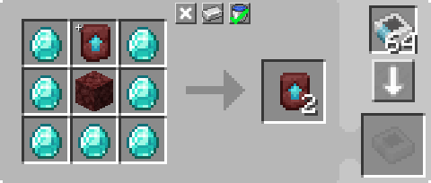

---
navigation:
  parent: example-setups/example-setups-index.md
  title: Рекурсивное создание
  icon: minecraft:netherite_upgrade_smithing_template
---

# Установка для рекурсивного создания

Как указано в [автосоздании](../ae2-mechanics/autocrafting.md), алгоритм планирования автосоздания не может обрабатывать рецепты, где
основной результат является одним из ингредиентов. Например, он не может справиться с клонированием <ItemLink id="minecraft:netherite_upgrade_smithing_template" />.

Одно из решений — использование способности <ItemLink id="level_emitter" /> притворяться [шаблоном](../items-blocks-machines/patterns.md).

Эта особенность будет использована для активации небольшой установки, которая постоянно выполняет создание. В данном случае мы рассмотрим установку
для клонирования <ItemLink id="minecraft:netherite_upgrade_smithing_template" />.

<RecipeFor id="minecraft:netherite_upgrade_smithing_template" />

***

<GameScene zoom="6" interactive={true}>
  <ImportStructure src="../assets/assemblies/recursive_recipe_setup.snbt" />

  <BoxAnnotation color="#dddddd" min="1 0 0" max="2 1 1">
        (1) Интерфейс: настроен на хранение необходимых дополнительных ингредиентов: алмаз и незерак.
        <Row><ItemImage id="minecraft:diamond" scale="2" /> <ItemImage id="minecraft:netherrack" scale="2" /></Row>
  </BoxAnnotation>

  <BoxAnnotation color="#dddddd" min="2.3 1 0.3" max="2.7 1.3 0.7">
        (2) Индикатор уровня: настроен на «Незеритовый шаблон кузнечного стола» и вставлена карта создания. Установлен в режим «Излучать редстоун-сигнал, чтобы начать создание предмета».
        <Row><ItemImage id="minecraft:netherite_upgrade_smithing_template" scale="2" /> <ItemImage id="crafting_card" scale="2" /></Row>
  </BoxAnnotation>

  <BoxAnnotation color="#dddddd" min="2 0 0" max="2.3 1 1">
        (3) Шина импортирования №1: отфильтрована на предметы, которые хранит интерфейс. Вставлена редстоуновая карта. Режим редстоун-сигнала установлен на
        «Активно при наличии сигнала».
        <Row>
        <ItemImage id="minecraft:diamond" scale="2" />
        <ItemImage id="minecraft:netherrack" scale="2" />
        <ItemImage id="redstone_card" scale="2" />
        </Row>
  </BoxAnnotation>

  <BoxAnnotation color="#dddddd" min="3 1 1" max="4 1.3 2">
        (4) Шина хранения №1: установлен более высокий приоритет, чем у другой шины хранения. ОЧЕНЬ ВАЖНО.
  </BoxAnnotation>

  <BoxAnnotation color="#dddddd" min="3 0 1" max="4 1 2">
        (5) Молекулярный сборщик: содержит шаблон для дублирования кузнечного шаблона.

        

        Также в него вручную вставлен один кузнечный шаблон при первом сборе этой установки.
  </BoxAnnotation>

  <BoxAnnotation color="#dddddd" min="2.7 0 1" max="3 1 2">
        (6) Шина импортирования №2: в конфигурации по умолчанию.
  </BoxAnnotation>

  <BoxAnnotation color="#dddddd" min="1 0 1" max="2 1 1.3">
        (7) Шина хранения №2: отфильтрована на «незеритовый шаблон кузнечного стола». Установлен более низкий приоритет, чем у другой шины хранения.
        <ItemImage id="minecraft:netherite_upgrade_smithing_template" scale="2" />
  </BoxAnnotation>

<DiamondAnnotation pos="0 0.5 0.5" color="#00ff00">
        Идёт в основную сеть
    </DiamondAnnotation>

  <IsometricCamera yaw="15" pitch="30" />
</GameScene>

## Конфигурации

* <ItemLink id="interface" /> (1) настроен на хранение необходимых дополнительных ингредиентов: алмаз и незерак.
* <ItemLink id="level_emitter" /> (2) настроен на «незеритовый шаблон кузнечного стола» и вставлена карта создания. Установлен в режим «Излучать редстоун-сигнал, чтобы начать создание предмета».
* Первая <ItemLink id="import_bus" /> (3) отфильтрована на предметы, которые хранит интерфейс. Имеет редстоуновую карту. Режим редстоун-сигнала установлен на «Активно при наличии сигнала».
* Первая <ItemLink id="storage_bus" /> (4) имеет *более высокий* [приоритет](../ae2-mechanics/import-export-storage.md#приоритет-хранения), чем вторая шина хранения, что **ОЧЕНЬ ВАЖНО**.
* <ItemLink id="molecular_assembler" /> (5) содержит шаблон для дублирования кузнечного шаблона и один кузнечный шаблон, вставленный вручную.

  

* Вторая <ItemLink id="import_bus" /> (6) находится в конфигурации по умолчанию.
* Вторая <ItemLink id="storage_bus" /> (7) отфильтрована на «незеритовый шаблон кузнечного стола». Имеет *более низкий* [приоритет](../ae2-mechanics/import-export-storage.md#приоритет-хранения), чем первая шина хранения.

## Как это работает

1. <ItemLink id="level_emitter" /> притворяется [шаблоном](../items-blocks-machines/patterns.md) благодаря вставленной
   <ItemLink id="crafting_card" /> и настройке «Излучать редстоун-сигнал, чтобы начать создание предмета». Таким образом, «Незеритовый шаблон кузнечного стола» отображается в
   [терминалах](../items-blocks-machines/terminals.md) как допустимый объект для [автосоздания](../ae2-mechanics/autocrafting.md).
2. При получении запроса на создание этого предмета, будь то от игрока или от самой системы, индикатор уровня включается.
3. Первая <ItemLink id="import_bus" /> активируется индикатором уровня и извлекает ингредиенты, хранимые в <ItemLink id="interface" />.
4. Единственная <ItemLink id="storage_bus" /> в сети, способная хранить эти ингредиенты, — это та, что на сборщике.
5. <ItemLink id="molecular_assembler" /> получает ингредиенты (уже имея внутри 1 кузнечный шаблон) и выполняет создание, производя 2 кузнечных шаблона.
6. Вторая <ItemLink id="import_bus" /> извлекает 1 кузнечный шаблон.
7. Первая шина хранения имеет более высокий приоритет, поэтому этот кузнечный шаблон возвращается в сборщик.
8. Вторая <ItemLink id="import_bus" /> извлекает 1 кузнечный шаблон.
9. Сборщик не может принять ещё один кузнечный шаблон, поэтому второй кузнечный шаблон отправляется в шину хранения с более низким приоритетом, вставляя его в интерфейс.
10. <ItemLink id="interface" />, не будучи настроенным на хранение кузнечных шаблонов, отправляет его в сеть.