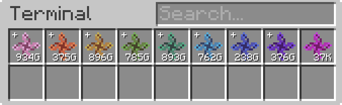

---
navigation:
  parent: appliede-index.md
  title: Трансмутационный модуль
  icon: emc_module
  position: 0
categories:
  - appliede
item_ids:
  - appliede:emc_module
---

# Трансмутационный модуль

<GameScene zoom="8" background="transparent">
  <ImportStructure src="assemblies/transmutation_module.snbt" />
</GameScene>

**МЭ трансмутационный модуль** — это ваш первый шаг к управлению EMC и алхимическим операциям внутри вашей МЭ сети. Будучи подключенным в *любом месте* МЭ сети, модуль задействует знания и энергию разместившего его алхимика и снабдит сеть его EMC как отдельным ресурсом. Это открывает МЭ сети возможность напрямую манипулировать данным EMC для трансмутации предметов в процессе автокрафта и других связанных операций. Эти предметы также предоставляются сети в виде автоматически генерируемых шаблонов крафта, поставляемых модулем, где эквивалентное значение EMC используется в качестве ингредиента для создания каждого предмета.

Несколько модулей могут быть размещены в одной сети любым количеством разных игроков, но только один модуль от каждого алхимика будет вносить вклад в общее количество хранимого EMC и доступных для "крафта" известных предметов. Когда в сети присутствует несколько модулей, EMC, поставляемый каждым из них, собирается в единый пул хранилища, подключаемый к сети только одним модулем в любой момент времени. При этом любые вложения и извлечения EMC будут поровну (насколько это возможно) распределяться между всеми игроками, предоставляющими EMC.

Модуль также включает дополнительные меры защиты для предотвращения проблем с переполнением в МЭ сетях, добавляя систему *уровней* (тиров) для хранящегося в сети EMC, основанную на последующих степенях произвольно большого числа (10^12) единиц EMC. Каждый уровень обозначается цветом, отличным от базовой единицы EMC, и при необходимости может быть "скрафчен вниз" до более низких уровней для выполнения любых более требовательных задач по трансмутации.

Однако имейте в виду, что вместе с мощностью, которую предоставляет этот модуль, приходит и солидная стоимость энергии по умолчанию в размере 25 AE/тик (возможно, больше или меньше в зависимости от настроек конфигурации).

## Рецепт

<RecipeFor id="appliede:emc_module" />