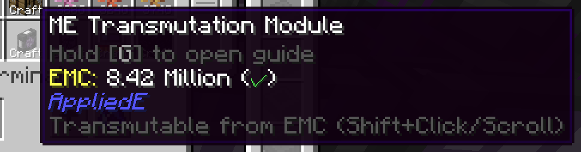
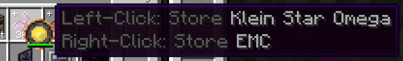
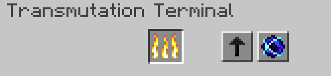
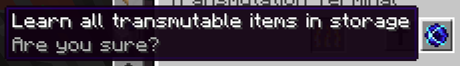

---
navigation:
  parent: appliede-index.md
  title: Трансмутационный терминал
  icon: transmutation_terminal
  position: 20
categories:
  - appliede
item_ids:
  - appliede:transmutation_terminal
  - appliede:wireless_transmutation_terminal
---

# Трансмутационный терминал

<GameScene zoom="8" background="transparent">
  <ImportStructure src="assemblies/transmutation_terminal.snbt" />
</GameScene>

Хотя до сих пор мы рассматривали способность МЭ сетей преобразовывать EMC в предметы посредством автокрафта и различных устройств трансмутации, предлагаемых AppliedE, остается вопрос: как игроку напрямую управлять своим EMC через свою МЭ систему?

Ответом на этот вопрос является **МЭ трансмутационный терминал** — терминал, который предоставляет пользователю большую часть функционала <ItemLink id="projecte:transmutation_table" /> из ProjectE, но интегрированного в стоящую за ним МЭ сеть.

Для начала, с помощью этого терминала *вы* как игрок можете напрямую извлекать известные трансмутируемые предметы из накопленного EMC, вместо того чтобы требовать их предварительного наличия в обычном хранилище предметов. Через этот терминал вы также можете заполнять и опустошать Звезды Клейна и другие предметы, хранящие EMC.

Экран терминала также включает знакомый огненный слот Трансмутационного стола, через который предметы обычно преобразуются в EMC, и для терминала этот слот работает практически так же. Однако на экране также есть две дополнительные кнопки, которые наделяют терминал дополнительными мощными функциями.

Кнопка со стрелкой слева переключает направление отправки стаков предметов при нажатии с Shift по отношению к терминалу. Если стрелка указывает вверх на общую сетку терминала, то предметы при Shift-клике отправятся в эту сетку и в обычное хранилище предметов. Однако если стрелка указывает влево на слот трансмутации, любые стаки при Shift-клике будут преобразованы в EMC и отправлены в общее сетевое хранилище EMC, а также изучены для пользователя, если они еще не были изучены.

Наконец, оставшаяся кнопка с сингулярностью позволяет пользователю терминала автоматически изучить каждый предмет в хранилище, который еще не был изучен для трансмутации. Однако это может обойтись очень дорого: предметы можно изучить только в том случае, если хотя бы один из них находится в хранилище, и один экземпляр каждого предмета будет немедленно трансмутирован в EMC. Это может повлечь за собой огромное потребление энергии в зависимости от того, сколько EMC стоит предмет. По этой причине рекомендуется проявлять осторожность, и кнопка предложит вам подумать дважды, прежде чем вы решите изучить все с ее помощью.

## Рецепт

<RecipeFor id="appliede:transmutation_terminal" />