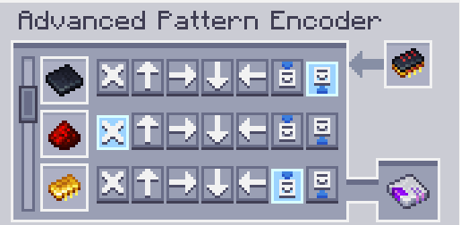

---
navigation:
  parent: aae_intro/aae_intro-index.md
  title: Расширенный кодировщик шаблонов
  icon: advanced_ae:adv_pattern_encoder
categories:
  - продвинутые предметы
item_ids:
  - advanced_ae:adv_pattern_encoder
  - advanced_ae:adv_processing_pattern
---

# Расширенный кодировщик шаблонов

Чтобы научить Расширенный поставщик шаблонов ME, куда отправлять ваши предметы, требуется специальное устройство для кодирования этой информации. Вы можете использовать его, нажав правой кнопкой мыши, держа его в руке, чтобы открыть его графический интерфейс.

<ItemImage id="advanced_ae:adv_pattern_encoder" scale="4"></ItemImage>

Закодированные шаблоны обработки можно вставить в левый слот, где они будут декодированы, а все необработанные ингредиенты затем отобразятся в списке.

Каждая строка содержит набор кнопок, которые представляют все возможные грани блока, на которые может быть отправлен ингредиент. Оставление выбора на кнопке «А» отправит его на любую грань, которая напрямую подключена к Поставщику шаблонов, в то время как выбор конкретной грани принудительно укажет, куда будут вставлены предметы. Важно отметить, что расширенные шаблоны могут быть правильно декодированы только <ItemLink id="advanced_ae:adv_pattern_provider" /> и будут вести себя как обычный шаблон, если используются в других типах поставщиков шаблонов. Кроме того, если один предмет не может быть вставлен в указанную грань, никакие предметы не будут вставлены направленно, и будет применено стандартное поведение поставщика шаблонов.