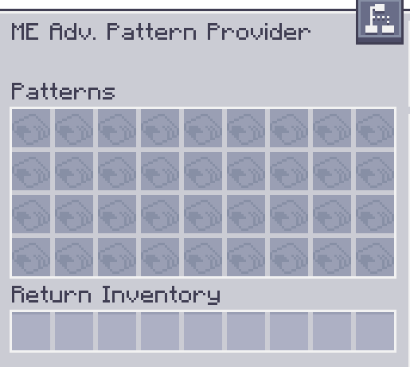

---
navigation:
  parent: aae_intro/aae_intro-index.md
  title: ME Улучшенный Поставщик Шаблонов
  icon: advanced_ae:adv_pattern_provider
categories:
  - продвинутые устройства
item_ids:
  - advanced_ae:adv_pattern_provider
  - advanced_ae:small_adv_pattern_provider
  - advanced_ae:adv_pattern_provider_part
  - advanced_ae:small_adv_pattern_provider_part
---

# ME Улучшенный Поставщик Шаблонов

<Row gap="20">
<BlockImage id="advanced_ae:adv_pattern_provider" scale="8"></BlockImage>
<BlockImage id="advanced_ae:adv_pattern_provider" p:push_direction="up" scale="8"></BlockImage>
<GameScene zoom="8" background="transparent">
  <ImportStructure src="../structure/cable_app_part.snbt"></ImportStructure>
</GameScene>
</Row>

ME Улучшенный Поставщик Шаблонов — это новый тип <ItemLink id="ae2:pattern_provider" />, который улучшает
стандартную версию или <ItemLink id="extendedae:ex_pattern_provider" />, добавляя возможность настраивать сторону, на
которую будет отправлен каждый отдельный предмет в шаблоне. Это мощное дополнение позволяет автоматизировать машины,
требующие определенных сторон для определенных входов, используя один блок и без труб!

*Смотрим на тебя, Mekanism.*

Чтобы использовать эту функцию, вам потребуется вставить <ItemLink id="advanced_ae:adv_processing_pattern" />, созданный
путем вставки закодированного шаблона в <ItemLink id="advanced_ae:adv_pattern_encoder" /> и получения улучшенной
версии.

Также существует расширенная версия, способная вмещать до 36 шаблонов в одном поставщике шаблонов.

