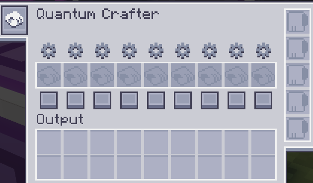
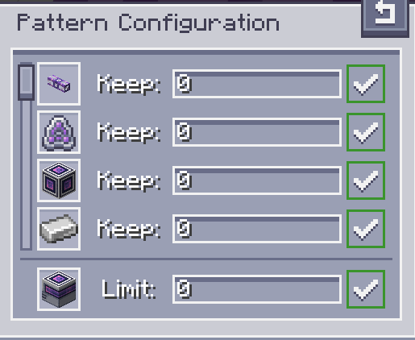

---
navigation:
  parent: aae_intro/aae_intro-index.md
  title: Квантовый Создатель
  icon: advanced_ae:quantum_crafter
categories:
  - продвинутые устройства
item_ids:
  - advanced_ae:quantum_crafter
---

# Квантовый Создатель

<BlockImage id="advanced_ae:quantum_crafter" p:working="true" scale="4"></BlockImage>

Квантовый Создатель — это мощный и настраиваемый авто-создатель. Имея в своем распоряжении весь инвентарь систем AE, непрерывное создание предметов становится тривиальной задачей. Он способен выполнять задания по созданию предметов очень быстро, при этом гарантируя, что у вас никогда не закончатся критически важные ресурсы. Он также способен выполнять крафты с заменой жидкостей, а также рекурсивные крафты, где вход является выходом.

## Использование Создателя

Чтобы использовать Квантовый Создатель, вам нужно разместить его в вашей сети и подключить кабелем. Для работы требуется один канал. Выберите, какие рецепты вы хотите выполнять постоянно, и закодируйте их в шаблон крафта. Эти шаблоны можно вставить в соответствующие слоты создателя.

После вставки появляются две кнопки, позволяющие настроить каждый шаблон. Квадратная кнопка внизу отвечает за включение/отключение шаблона. Отключенные шаблоны никогда не будут создаваться, но включенные шаблоны по-прежнему следуют набору условий. Чтобы установить эти условия, вам нужно нажать кнопку с шестеренкой, чтобы открыть пользовательский интерфейс конфигурации шаблона.

В пользовательском интерфейсе конфигурации шаблона перечислены все ингредиенты и основной выходной продукт. Вы можете использовать числовые поля ввода, чтобы регулировать, сколько каждого ингредиента вы хотите постоянно хранить в системе ME, а также установить максимальное количество конечного продукта, чтобы избежать избыточного создания дорогих предметов. После ввода желаемого числа (которое также принимает математические выражения) вам нужно нажать Enter, чтобы применить ввод. Индикация справа покажет, были ли значения применены или нет. В частности, при настройке лимита вывода, если значение установлено на 0, лимит снимается, и создание будет продолжаться до тех пор, пока не закончатся входные ресурсы.

## Выходы

Выходные данные крафтов, выполняемых квантовым создателем, очень гибки в настройке. Конфигурация по умолчанию будет пытаться перемещать предметы непосредственно из выходных слотов в систему ME. Левым щелчком по кнопке ячейки на левой панели инструментов можно настроить вывод предметов в соседние инвентари. Это дополнительно настраивается нажатием другой кнопки, которая появляется при включении этой настройки, что позволяет выбрать, какие стороны будут считаться включенными для автоэкспорта. Комбинация этих двух конфигураций должна обеспечить достаточный контроль и творческий выбор в использовании создателя.

## Улучшения

Чтобы раскрыть весь потенциал Квантового Создателя, необходимо установить карты улучшений. Он может принимать <ItemLink id="ae2:speed_card" /> и <ItemLink id="ae2:redstone_card" />. Первая значительно ускоряет скорость создания, достигая 64 крафтов каждого шаблона в тик, в то время как вторая обеспечивает управление редстоуном.