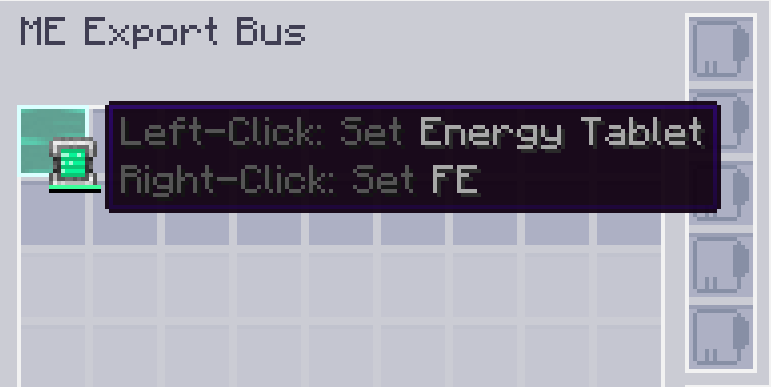

---
navigation:
  parent: appflux/appflux-index.md
  title: Пометить FE
categories:
- хитрости flux
---

# Как пометить FE в слоте конфигурации

Возможно, вы захотите выводить энергию с помощью <ItemLink id="ae2:export_bus"/>, и вам нужно пометить FE в его слоте конфигурации.

Щелкните правой кнопкой мыши по слоту с контейнером энергии, чтобы пометить FE.

