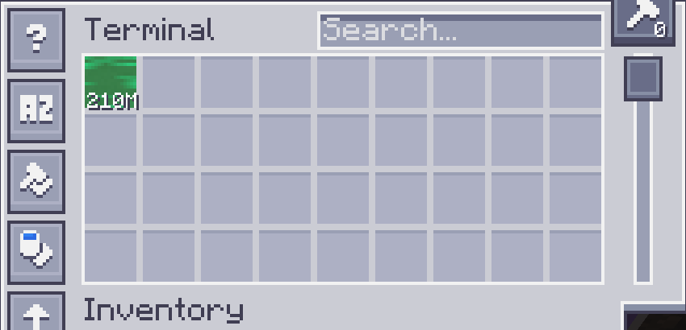
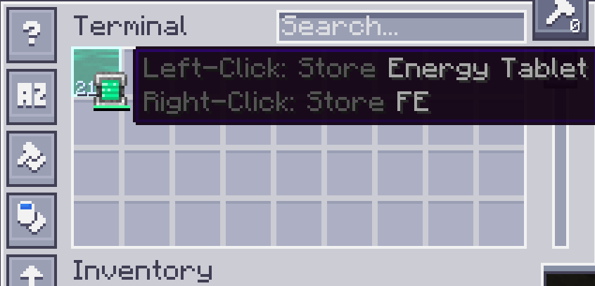

---
navigation:
  parent: appflux/appflux-index.md
  title: Взаимодействия с Терминалом
categories:
- flux tricks
---

# Взаимодействия с Терминалом

Терминалы будут отображать накопленную энергию в виде этой *зеленой жидкости*.

Это не настоящая жидкость, и вы не можете использовать ведра для ее заполнения.

Вы можете использовать энергетический контейнер, такой как батареи, электрические инструменты, чтобы заполнять/сливать энергию в/из него.

