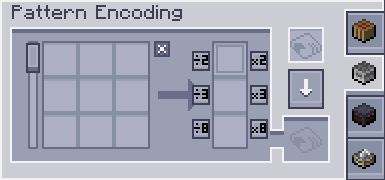

---
navigation:
  parent: expandedae-index.md
  title: Расширенный Терминал Кодирования
  icon: exp_encoding_terminal
  position: 7
categories:
  - expandedae
item_ids:
- expandedae:exp_encoding_terminal
- expandedae:wireless_exp_encoding_terminal
---

<GameScene zoom="4" background="transparent">
  <ImportStructure src="structures/exp_encoding.snbt" />
  <IsometricCamera yaw="195" pitch="30" />
</GameScene>

## Расширенный Терминал Кодирования — это улучшенная версия оригинального терминала, добавляющая следующие функции
 - Shift-клик при кодировании шаблона перемещает его в ваш инвентарь
 - Кнопки умножения прямо в терминале

