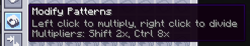
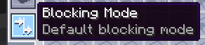

---
navigation:
  parent: expandedae-index.md
  title: QoL Функции
  icon: expandedae:exp_pattern_provider
  position: 10
categories:
  - expandedae
---

# Мод добавляет все перечисленные ниже QoL-функции
## Умножение шаблонов в Поставщиках Шаблонов:  
Это добавляет кнопку в Поставщик Шаблонов, позволяющую умножать или делить все находящиеся внутри шаблоны.  
__Множители складываются!__

## Дополнительные режимы блокировки  
Мод добавляет два дополнительных режима блокировки во все Поставщики Шаблонов.

### Default (По умолчанию):  
Стандартный режим блокировки из AE2.  
Он отправляет шаблон, если подключённое хранилище **не содержит ни одного из входов шаблона** этого Поставщика.  
Если хранилище содержит **что-то, что не является входом шаблона**, режим блокировки пропускает проверку и всё равно отправляет шаблон.

### Full (Полный):  
В этом режиме шаблон **не будет отправлен**, если подключённое хранилище содержит **что угодно**.

### Smart (Умный):  
Позволяет Поставщику Шаблонов отправлять **тот же шаблон**, если целевое хранилище содержит **только входы именно этого шаблона**.

