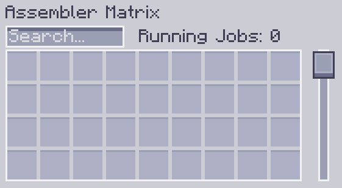

---
navigation:
    parent: epp_intro/epp_intro-index.md
    title: Матрица Сборщика
    icon: extendedae:assembler_matrix_frame
categories:
- расширенные устройства
item_ids:
- extendedae:assembler_matrix_frame
- extendedae:assembler_matrix_wall
- extendedae:assembler_matrix_glass
- extendedae:assembler_matrix_pattern
- extendedae:assembler_matrix_crafter
- extendedae:assembler_matrix_speed
---

# Матрица Сборщика

<Row>
<BlockImage id="extendedae:assembler_matrix_frame" p:formed="true" p:powered="true" scale="5"></BlockImage>
<BlockImage id="extendedae:assembler_matrix_wall" scale="5"></BlockImage>
<BlockImage id="extendedae:assembler_matrix_glass" scale="5"></BlockImage>
</Row>
<Row>
<BlockImage id="extendedae:assembler_matrix_pattern" scale="5"></BlockImage>
<BlockImage id="extendedae:assembler_matrix_crafter" scale="5"></BlockImage>
<BlockImage id="extendedae:assembler_matrix_speed" scale="5"></BlockImage>
</Row>

Матрица Сборщика — это многоблочная структура. Она представляет собой комбинацию <ItemLink id="ae2:molecular_assembler" /> и <ItemLink id="ae2:pattern_provider" />.
Она может выполнять множество заданий по крафту одновременно (при наличии достаточного количества <ItemLink id="ae2:crafting_accelerator" /> в вашей сети ME) и экономить каналы.

## Структура

<GameScene zoom="3" background="transparent" interactive={true}>
  <ImportStructure src="../structure/assembler_matrix.snbt"></ImportStructure>
</GameScene>

Это прямоугольная призма с длиной ребер от 3 до 7.
- Ребра состоят из Каркаса Матрицы Сборщика.
- Грани состоят из Стены/Стекла Матрицы Сборщика.
- Внутреннее пространство состоит из Ядра Матрицы Сборщика (Шаблон/Крафт/Скорость).

Действительная Матрица Сборщика должна содержать как минимум одно ядро шаблонов и ядро крафта.
Она должна быть полностью заполнена и не может быть полой.
Когда Матрица Сборщика правильно сформирована и запитана, линии на Каркасе Матрицы Сборщика станут синими.

## Ядро Матрицы Сборщика

Существует 3 различных Ядра Матрицы Сборщика.

- Ядро Шаблонов Матрицы Сборщика

Матрица Сборщика берет шаблоны только из своего ядра шаблонов. Каждое ядро шаблонов предоставляет 36 слотов для шаблонов для Матрицы Сборщика.

- Ядро Крафта Матрицы Сборщика

Матрица Сборщика будет назначать полученные задания по крафту своим ядрам крафта. Каждое ядро крафта может выполнять 8 заданий по крафту одновременно.

- Ядро Скорости Матрицы Сборщика

Это <ItemLink id="ae2:speed_card" /> для Матрицы Сборщика. 5 ядер скорости позволяют Матрице Сборщика работать на полной скорости.
Установка более 5 ядер скорости не даст дополнительного увеличения скорости.

## Интерфейс

Щелчок правой кнопкой мыши по сформированной и подключенной Матрице Сборщика откроет ее интерфейс.

Вы можете помещать или искать шаблоны в нем, а также просматривать, сколько заданий по крафту оно выполняет.
---