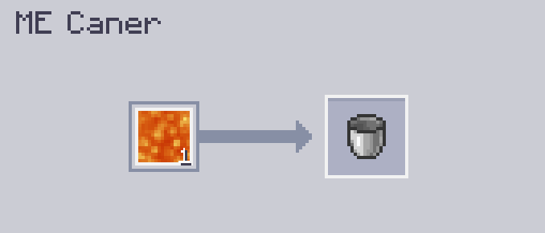
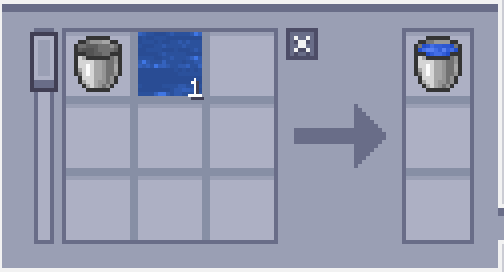
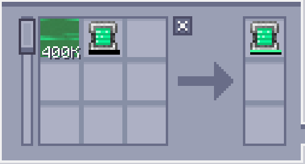

---
navigation:
    parent: epp_intro/epp_intro-index.md
    title: ME Консерватор
    icon: extendedae:caner
categories:
- расширенные устройства
item_ids:
- extendedae:caner
---

# ME Консерватор

<BlockImage id="extendedae:caner" scale="8"></BlockImage>

ME Консерватор — это машина, которая "консервирует" различные вещества, включая жидкости, газ Mekanism, ману Botania и даже энергию!

Первый слот предназначен для того, чем заполнять, а второй — для того, что заполняется.

Для работы ему требуется энергия, и каждая операция стоит 80 AE.

По умолчанию он заполняет только жидкости; чтобы он мог заполнять другие вещества, необходимо установить соответствующий аддон.

### Поддерживаемые аддоны:
- Applied Flux
- Applied Mekanistics
- Applied Botanics Addon

## Автокрафт с ME Консерватором

Только верхняя и нижняя стороны могут принимать энергию и подключаться к сети.

<GameScene zoom="6" background="transparent">
  <ImportStructure src="../structure/caner_example.snbt"></ImportStructure>
</GameScene>

Простая установка для ME Консерватора. ME Консерватор будет автоматически выбрасывать заполненный предмет, когда он принимает ингредиенты от <ItemLink id="ae2:pattern_provider" />.

<GameScene zoom="6" background="transparent">
  <ImportStructure src="../structure/caner_auto.snbt"></ImportStructure>
</GameScene>

Шаблон должен содержать только вещество для заполнения и контейнер, который будет заполняться. Вот несколько примеров:

Заполнение ведра с водой:

Зарядка энергетического планшета (требуется установленный Applied Flux):

## Расконсервация

ME Консерватор также может извлекать вещества из контейнера в режиме Опустошения. Вам нужно поменять местами входы и выходы в шаблоне.

---