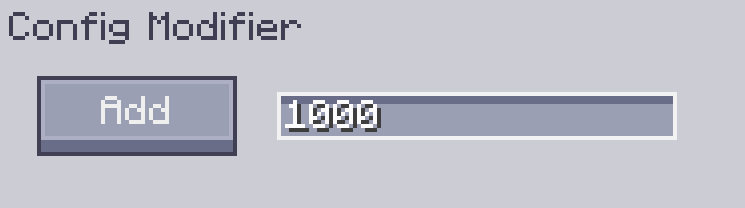

---
navigation:
    parent: epp_intro/epp_intro-index.md
    title: Модификатор Настроек
    icon: extendedae:config_modifier
categories:
- extended items
item_ids:
- extendedae:config_modifier
---

# Модификатор Настроек

Модификатор Настроек — это инструмент для массового изменения инвентаря настроек.

<ItemImage id="extendedae:config_modifier" scale="4"></ItemImage>

Нажмите на него правой кнопкой мыши, чтобы открыть его ГИП.

## Использование

Модификатор Настроек может быстро изменять такие вещи, как инвентарь настроек интерфейса, с помощью своих настроек, например, устанавливая количество элементов настроек на максимальное значение или просто удаляя их все.

Вы можете нажать на целевое устройство (блок или подчасть) в мире с Модификатором Настроек, чтобы изменить его настройки.

## Настройки

У него есть две основные настройки: **режим модификации** и **количество модификации (X)**.

Вы можете нажать кнопку, чтобы изменить режим.

- Добавить/Вычесть/Умножить/Разделить: Добавить/Вычесть/Умножить/Разделить количество настроек на X.
- Максимизировать: Установить количество настроек на максимальное значение.
- Минимизировать: Установить количество настроек на минимальное значение.
- Установить: Установить количество настроек на X.
- Очистить: Очистить все настройки.

---