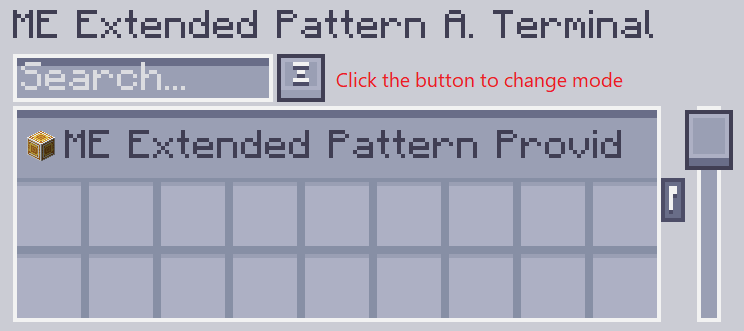
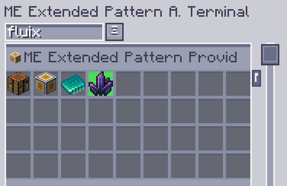
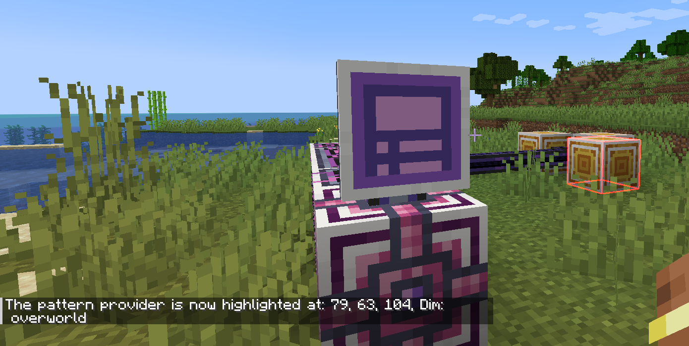

---
navigation:
    parent: epp_intro/epp_intro-index.md
    title: Расширенный терминал доступа к шаблонам ME
    icon: extendedae:ex_pattern_access_part
categories:
- расширенные устройства
item_ids:
- extendedae:ex_pattern_access_part
- extendedae:wireless_ex_pat
---

# Расширенный терминал доступа к шаблонам ME

Расширенный терминал доступа к шаблонам ME предоставляет 3 дополнительные функции по сравнению с <ItemLink id="ae2:pattern_access_terminal" />.

<Row gap="20">
<GameScene zoom="6" background="transparent">
<ImportStructure src="../structure/cable_ex_pattern_terminal.snbt"></ImportStructure>
<IsometricCamera yaw="180"></IsometricCamera>
</GameScene>
<ItemImage id="extendedae:wireless_ex_pat" scale="4"></ItemImage>
</Row>

## Улучшенный поиск шаблонов

Вы можете искать шаблоны по названиям входных/выходных ингредиентов.

## Подсветка шаблонов

Иногда все еще трудно найти нужный шаблон, поскольку шаблоны всегда отображаются группами. Теперь Расширенный терминал доступа к шаблонам может подсвечивать совпадающий шаблон в графическом интерфейсе.

## Подсветка поставщиков шаблонов в мире

Раздражает искать, какой поставщик шаблонов застрял при выполнении больших задач по крафту. Расширенный терминал доступа к шаблонам может подсвечивать поставщиков шаблонов в мире, чтобы вы могли легко их найти.

---