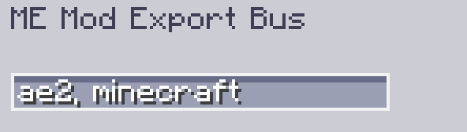

---
navigation:
    parent: epp_intro/epp_intro-index.md
    title: Шина экспорта модов ME
    icon: extendedae:mod_export_bus
categories:
- расширенные устройства
item_ids:
- extendedae:mod_export_bus
---

# Шина экспорта модов ME

<GameScene zoom="8" background="transparent">
  <ImportStructure src="../structure/cable_mod_export_bus.snbt"></ImportStructure>
</GameScene>

Шина экспорта модов ME представляет собой <ItemLink id="ae2:export_bus" />, которая может быть отфильтрована по имени или ID мода.

Используйте запятую для разделения нескольких ID модов в случае, если вы хотите отфильтровать несколько модов.

---