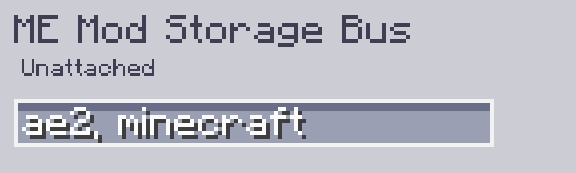

---
navigation:
    parent: epp_intro/epp_intro-index.md
    title: ME Шина хранения по модам
    icon: extendedae:mod_storage_bus
categories:
- extended devices
item_ids:
- extendedae:mod_storage_bus
---

# ME Шина хранения по модам

<GameScene zoom="8" background="transparent">
  <ImportStructure src="../structure/cable_mod_storage_bus.snbt"></ImportStructure>
</GameScene>

ME Mod Storage Bus — это <ItemLink id="ae2:storage_bus" />, которую можно фильтровать по названию мода или ID мода.

Используйте запятую для разделения нескольких ID модов, если вы хотите отфильтровать несколько модов.

---