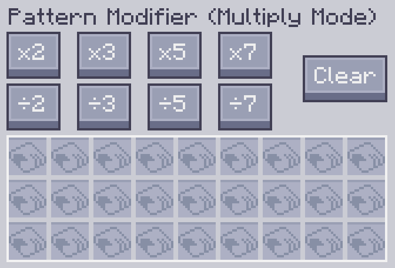
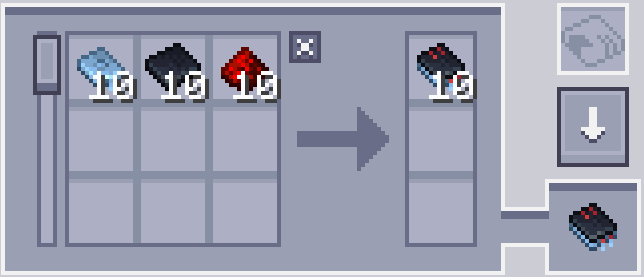
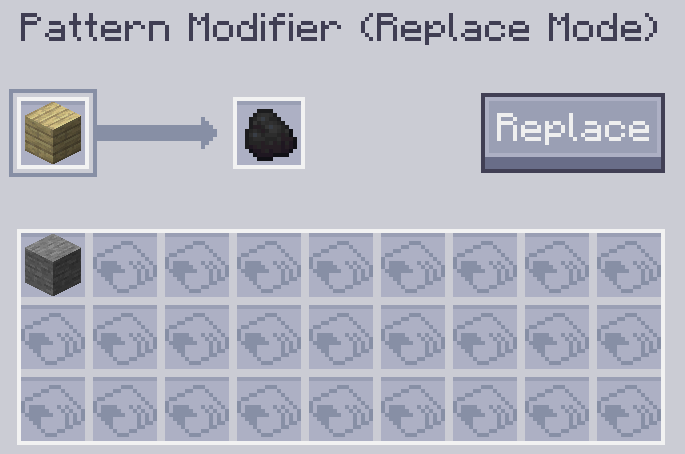
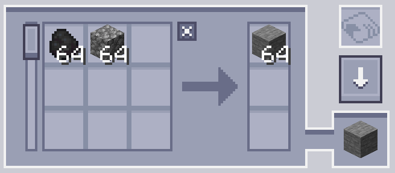
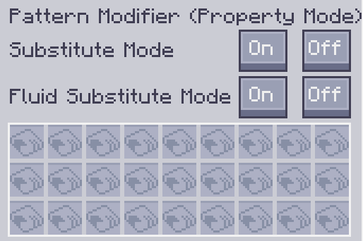

---
navigation:
    parent: epp_intro/epp_intro-index.md
    title: Модификатор Шаблонов
    icon: extendedae:pattern_modifier
categories:
- extended items
item_ids:
- extendedae:pattern_modifier
---

# Модификатор Шаблонов

Модификатор Шаблонов — это инструмент для массового изменения шаблонов.

<ItemImage id="extendedae:pattern_modifier" scale="4"></ItemImage>

Нажмите правой кнопкой мыши, чтобы открыть его графический интерфейс.

## Режим умножения

Вы можете умножить/разделить количество входов и выходов шаблона обработки на x, нажав соответствующую кнопку.

Исходный шаблон:

После x10:

Он также может очистить содержимое всех шаблонов и превратить их в пустые шаблоны, нажав кнопку "Очистить".

### Примечания:

 - Кнопка деления работает только тогда, когда количество делимо. Например, кнопка ÷2 не будет работать, когда шаблон требует 3 булыжника в качестве входного материала, потому что 3÷2 равно 1.5.

 - Кнопка умножения имеет ограничение (999999). Она не может увеличить количество одного ингредиента сверх этого числа.

## Режим замены

Заменяет определенный входной и выходной ингредиент шаблона другим предметом.

Слот A — это то, что будет заменено, а слот B — это то, на что будет заменен целевой элемент.

Например, следующая настройка заменит доску углем.

Нажмите кнопку "Заменить", чтобы выполнить замену.

## Режим свойств

Изменяет режимы замещений и замещений жидкостей шаблона крафта.

## Режим клонирования

В этом режиме вы можете скопировать любой заданный шаблон.

---