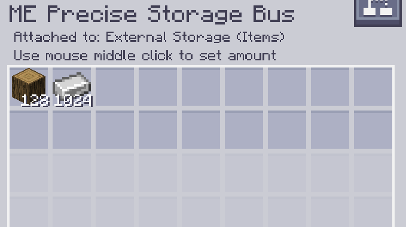

---
navigation:
    parent: epp_intro/epp_intro-index.md
    title: Шина точного хранения МЭ
    icon: extendedae:precise_storage_bus
categories:
- расширенные устройства
item_ids:
- extendedae:precise_storage_bus
---

# Шина точного хранения МЭ

<GameScene zoom="8" background="transparent">
  <ImportStructure src="../structure/cable_precise_storage_bus.snbt"></ImportStructure>
</GameScene>

Шина точного хранения МЭ — это <ItemLink id="ae2:storage_bus" />, которую можно отфильтровать по числу, и она будет вставлять предметы только до этого предела.

---
