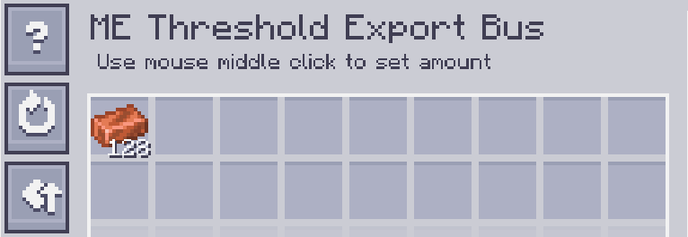
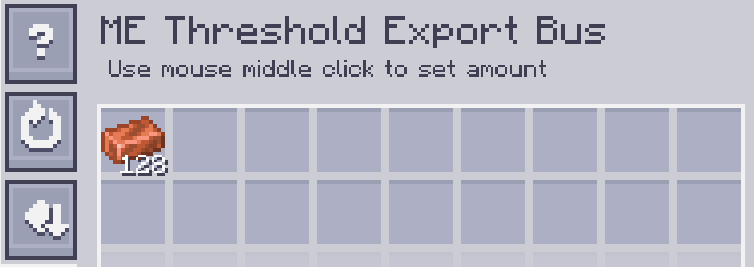

---
navigation:
    parent: epp_intro/epp_intro-index.md
    title: Шина экспорта по порогу ME
    icon: extendedae:threshold_export_bus
categories:
- расширенные устройства
item_ids:
- extendedae:threshold_export_bus
---

# Шина экспорта по порогу ME

<GameScene zoom="8" background="transparent">
  <ImportStructure src="../structure/cable_threshold_export_bus.snbt"></ImportStructure>
</GameScene>

Шина экспорта по порогу ME работает, когда количество предмета, хранящегося в сети ME, находится выше/ниже порогового значения.

## Пример

Пороговое значение для меди установлено на 128, поэтому шина экспортирует медь, когда запас меди в сети превышает 128.

Пороговое значение такое же, как и выше, но режим установлен на НИЖЕ. Шина экспортирует медь, когда запас меди ниже 128.

---
