---
navigation:
  title: Ячейка для сыпучих предметов
  icon: bulk_item_cell
  parent: index.md
  position: 040
categories:
  - megacells
item_ids:
  - bulk_item_cell
  - bulk_cell_component
  - compression_card
  - decompression_module
---

# MEGA Ячейки: Ячейка для сыпучих предметов

Теперь мы переходим к первой из *специализированных* ячеек хранения MEGA. Здесь становится интересно.

## Ячейка для сыпучих предметов

<Row>
  <ItemImage id="bulk_cell_component" scale="3" />
  <ItemImage id="bulk_item_cell" scale="3" />
</Row>

**Ячейка для сыпучих предметов MEGA** во многом является своего рода антитезой
[обычной ячейке хранения](ae2:items-blocks-machines/storage_cells.md).

В то время как стандартная ячейка обычно способна хранить до 63 различных типов предметов, Ячейка для сыпучих предметов
способна хранить только один тип внутри себя. Само по себе это сделало бы ячейку довольно бессмысленной, но Ячейка для сыпучих предметов
имеет одно ключевое преимущество: в отличие от конечного количества каждого типа предметов в стандартной ячейке, Ячейка для сыпучих предметов
способна хранить ***бесконечное*** количество этого одного типа предметов. И я действительно имею в виду *бесконечное*, по крайней мере, в
практическом смысле. *(см. раздел "Техническая скука" чуть ниже, если вам достаточно любопытно)*

Также стоит отметить, что Ячейка для сыпучих предметов не может быть создана с использованием каких-либо существующих корпусов ячеек, предлагаемых
AE2 или MEGA, вместо этого она использует свой собственный корпус из незерита, всегда создаваемый с нуля вместе со своим
специализированным компонентом. По этой причине Ячейка для сыпучих предметов также не может быть разобрана обратно на компонент и корпус —
хотя в этом все равно не было бы особого смысла.

<Row>
  <RecipeFor id="bulk_cell_component" />
  <RecipeFor id="bulk_item_cell" />
</Row>

Недавно созданная Ячейка для сыпучих предметов еще не может функционировать; сначала ее нужно *разделить* (отфильтровать), чтобы
обозначить, какой предмет она будет хранить. Это делается с помощью <ItemLink id="ae2:cell_workbench" /> или нашего удобного
<ItemLink id="portable_cell_workbench" />. Как только это будет сделано, ячейка начнет принимать соответствующий предмет,
даже отдавая приоритет себе как первому и, вероятно, единственному месту, куда этот предмет будет отправлен с момента установки фильтра.

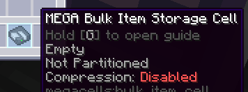
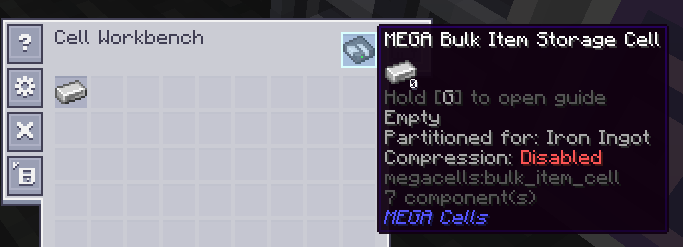
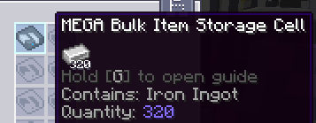

Как только ячейка начала принимать и хранить соответствующий тип предмета, до тех пор, пока фильтр остается тем же, что и
уже содержащийся предмет, она будет продолжать функционировать и позволять как дальнейшую вставку, так и извлечение, как
обычная ячейка. Однако, если этот фильтр будет случайно очищен или заменен, ячейка выдаст ошибку и
станет неспособной принимать новые предметы. Тем не менее, она позволит извлечь свое существующее содержимое в случае
чрезвычайной ситуации и для восстановления, и как только либо исходный фильтр будет заменен, либо ячейка будет
опустошена (получит новый непустой фильтр), она снова начнет функционировать как обычно.

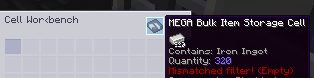
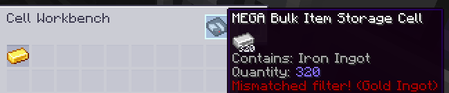

### Техническая скука о вместимости:

Обычно можно думать о "бесконечной вместимости" в любом моде Minecraft как о максимально возможном значении
данного типа числовых данных, таких как предел в Java для "int" (около 2,14 миллиарда), "long" (около
9,2 *квинтиллиона*, или 9,2 \* 10^**18**) или даже "double" (который уже достигает *308* порядков величины, хотя
он здесь совершенно не подходит для работы с целыми числами).

Ячейка для сыпучих предметов отбрасывает все эти примитивные типы и вместо этого спроектирована таким образом, чтобы хранить любое
произвольно большое количество, которое пользователь мог бы разумно представить. Действительно, хотя любая ME-сеть
сможет обрабатывать и отображать только до вышеупомянутых 9,2 квинтиллиона любого данного типа предметов, хранящихся в ней,
Ячейка для сыпучих предметов внутренне способна выходить за этот предел и, по крайней мере, намекать на то, что она это сделала.

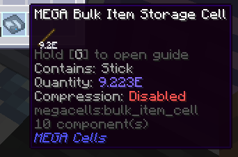
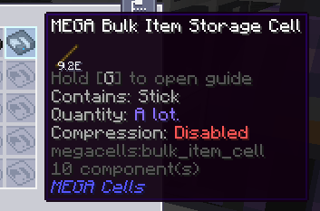

## Сжатие сыпучих предметов

<Row>
  <ItemImage id="compression_card" scale="3" />
</Row>

До сих пор мы хорошо освещали, как ячейка для сыпучих предметов работает как фактически бездонная яма для любого произвольного
типа предметов. Однако большинству игроков широко известно, что некоторые типы предметов — а именно, ресурсы, такие как *металлические
слитки* — должны обрабатываться немного по-другому для целей хранения. Очень часто такие ресурсы, как слитки, принимают
множество форм для хранения и крафта, например, их более крупные "блочные" аналоги для первого, чтобы минимизировать
пространство, и их меньшая форма "самородка" для последнего. Хотя обычно лучше обрабатывать их вместе с их
соответствующим слитком каким-либо образом, Ячейка для сыпучих предметов в своей стандартной форме не смогла бы легко справиться с этим ожиданием.

Именно здесь на помощь приходит механика ***Сжатия сыпучих предметов*** благодаря **Карте сжатия**, уникальной
[карте улучшения](ae2:items-blocks-machines/upgrade_cards.md), эксклюзивной для Ячейки для сыпучих предметов.

<RecipeFor id="compression_card" />

При включенном *Сжатии* с помощью этой карты, Ячейка для сыпучих предметов может быть осведомлена о таких вариантах формы ресурса,
который отслеживается, чтобы одинаково принимать эти варианты и автоматически "сжимать" их по мере их поступления в их следующий
наивысший вариант. Это автоматическое сжатие работает в соответствии с рецептами крафта, связанными с этими вариантами: если
один из этих рецептов превращал что-то, например, один (1) металлический слиток в девять (9) самородков этого металла, а другой
рецепт превращал эти девять самородков обратно в один исходный слиток, Ячейка для сыпучих предметов, настроенная на хранение этого металла,
смогла бы принимать как форму слитка, так и форму самородка этого металла, превращая каждые 9 вставленных самородков в еще один слиток на лету.

Кроме того, это автоматическое сжатие распространяется на *все* более высокие варианты, такие как металлические блоки и даже более сильно
"сжатые" версии этих блоков, предоставляемые такими модами, все вместе обрабатываемые как одна длинная "цепочка" вариантов
от наименьшего к наибольшему.

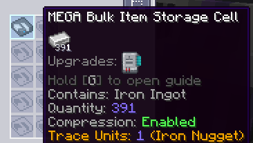

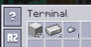
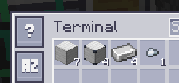

Для того чтобы эта механика работала, Ячейка для сыпучих предметов внутренне отслеживает свое фактическое "количество" как количество
наименьшего возможного "единичного" предмета, в который ресурс может быть переработан — обычно это либо металлический самородок, осколок драгоценного камня,
пыль или какой-либо другой эквивалент. Вдоль более широкой цепочки, упомянутой ранее, Ячейка для сыпучих предметов с включенной этой механикой
с радостью примет любые и все эти варианты, как более высокие, так и более низкие, преобразуя их в некоторое количество "единиц"
там, где это применимо, и даже позволит *извлекать* любой из них либо автоматическими средствами — такими как
<ItemLink id="ae2:import_bus" /> и <ItemLink id="ae2:export_bus" /> — либо даже
[терминалом](ae2:items-blocks-machines/terminals.md) (при *Shift*-клике для извлечения).

В случае, когда может присутствовать мод, добавляющий гораздо более "сжатые" блочные версии ресурса, может быть желательно
ограничить, насколько высоко ресурс может идти с автосжатием, чтобы иметь возможность более легко отслеживать количество этого
ресурса в определенной форме, например, при просмотре пропускной способности этого ресурса в форме слитка. Для этой цели,
Ячейка для сыпучих предметов с включенным сжатием, все еще находящаяся в верстаке ячеек, позволит переключать свой "порог сжатия",
определяя самый высокий вариант, который ячейка должна быть способна накапливать в хранилище, и на котором
автосжатие должно остановиться. Левый клик по этой кнопке переключает порог вниз к наименьшей единице предмета, в то время как
правый клик переключает назад к более и более сжатым вариантам.

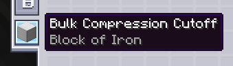
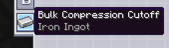

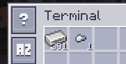

Когда сжатие включено на ячейке, поведение "несоответствие фильтра" становится немного более мягким: ячейка эффективно
"запоминает", с какой цепочкой ей нужно работать, основываясь на предмете, который она уже должна хранить, и если ее фильтр
случайно удален каким-либо образом, его можно заменить любым из связанных вариантов, а не конкретным вариантом,
использовавшимся ранее в качестве фильтра. Кроме того, для целей исправления ошибок, в случае, если какие-либо рецепты крафта
для какого-либо варианта, меньшего, чем предмет, настроенный на ячейке, добавляются, удаляются или заменяются, текущий "единичный
фактор" — то есть, сколько "единиц" поместится в общей сложности в один экземпляр настроенного "вариантного" предмета — также
хранится и отслеживается, обновляясь соответствующим образом, когда общая цепочка для этих вариантов претерпевает такое изменение.

В крайнем случае, если в худшем сценарии ячейка для сыпучих предметов полностью заблокирована независимо от примененного (повторно) фильтра
и переходит в вышеупомянутый режим "восстановления", любые меньшие следовые варианты могут быть восстановлены вместе с
базовым предметом, для которого ячейка была изначально разделена.

## Модуль декомпрессии

<GameScene zoom="8" background="transparent">
  <ImportStructure src="assets/assemblies/decompression_module.snbt" />
  <IsometricCamera yaw="195" pitch="10" />
</GameScene>

Пока все хорошо. Мы знаем, что при включенном сжатии Ячейка для сыпучих предметов может легко работать с любыми соответствующими вариантами
при вставке или извлечении либо игроком, либо устройствами, такими как <ItemLink id="ae2:import_bus" /> и
<ItemLink id="ae2:export_bus" />. А что насчет автокрафта?

Это немного сложнее. В AE2 система [автокрафта](ae2:ae2-mechanics/autocrafting.md) основана на предположении, что
"что видишь, то и получаешь". Если система хранения сообщает, например, 5 железных слитков, то система крафта
будет предполагать, что без [шаблона](ae2:ae2-mechanics/autocrafting.md#patterns), который бы указывал, как сделать больше железных слитков,
у нее будет только эти 5 для выполнения данной работы по крафту, и она не сможет ее выполнить, если потребуется больше слитков.
Проблема возникает тогда, когда при настроенном сжатии для Ячейки для сыпучих предметов, которая хранит железные слитки,
система хранения может никогда не сообщать более (обычно) 8 слитков в любой момент времени, если ячейка настроена на более высокий порог,
что делает систему крафта неспособной работать с любой задачей, которая может в конечном итоге потребовать больше железных слитков для выполнения предыдущего шага.

Решение этой проблемы представлено в виде **Модуля декомпрессии MEGA**, относительно простой кабельной части, которая
служит почти как расширение для системы автокрафта и средств обычной сети.

<RecipeFor id="decompression_module" />

Когда Модуль декомпрессии размещается где-либо в сети, он непрерывно сканирует сеть на предмет любых подключенных
Ячеек для сыпучих предметов с включенным сжатием и автоматически генерирует набор специализированных "фальшивых шаблонов" для каждой такой ячейки,
которую он находит, охватывая каждый предмет в цепочке вариантов, соответствующей этой ячейке. Эти шаблоны затем обрабатываются
полностью внутренне, без необходимости в каких-либо выделенных <ItemLink id="ae2:pattern_provider" /> или
<ItemLink id="ae2:molecular_assembler" /> настройках, позволяя системе крафта продолжать работать в обычном режиме,
"крафтя" больше предмета, который технически уже хранится.

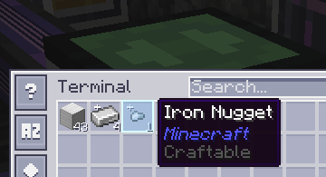

Эти шаблоны соответствующим образом реагируют на порог, установленный на отдельной Ячейке для сыпучих предметов; шаблоны, сгенерированные для вариантов
меньше порогового предмета, берут свой предыдущий более высокий вариант, чтобы быть переработанными *вниз* в несколько из этих меньших вариантов,
в то время как шаблоны, сгенерированные для более крупных вариантов, берут несколько предыдущих меньших вариантов, чтобы быть переработанными вверх.
Однако, какое бы направление ни было выбрано для этих шаблонов, каждый вариант по обе стороны от точки отсечения все еще автоматически
учитывается в случае, если более крупная работа по крафту требует их.

Модуль также позволяет установить "глобальный" [приоритет](ae2:ae2-mechanics/autocrafting.md#priority) для всех этих
шаблонов вместе, относительно любой обычной инфраструктуры крафта, такой как Pattern Providers с их собственными шаблонами для
данного вариантного предмета, путем правого клика по модулю, чтобы открыть меню приоритета.

Модуль декомпрессии — это устройство типа "установил и забыл", и вам обычно нужен только один модуль в данной сети, чтобы
включить все его функции автокрафта. ***ОДНАКО, ИМЕЙТЕ В ВИДУ***, что модуль функционирует только в рамках одной сети и может
отслеживать только те ячейки, которые подключены к ME-сундукам и дискам в той же основной сети, что и он сам. Он
***НЕ БУДЕТ РАБОТАТЬ*** через [подсети](ae2:ae2-mechanics/subnetworks.md), например, поэтому вы должны убедиться, что ваше
хранилище сыпучих предметов остается централизованным в вашей основной сети, чтобы модуль мог его распознать.