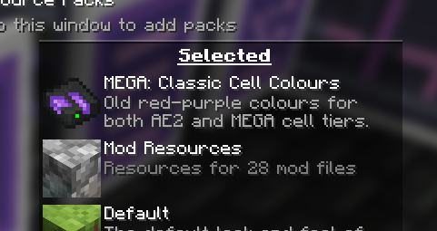
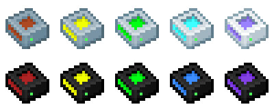
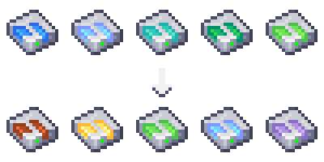
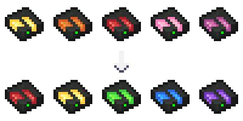

---
navigation:
  title: Дополнения
  icon: mega_interface
  parent: index.md
  position: 060
categories:
  - megacells
item_ids:
  - mega_interface
  - cell_dock
  - portable_cell_workbench
---

# MEGA Ячейки: Дополнения

Рассмотрев основную идею дополнения, мы теперь завершаем обзор некоторыми меньшими дополнительными функциями и
добавлениями, предоставленными MEGA, как для полноты, так и для возможности дальнейших экспериментов.

## MEGA Интерфейс

<Row>
  <BlockImage id="mega_interface" scale="4" />
  <GameScene zoom="4" background="transparent">
    <ImportStructure src="assets/assemblies/cable_mega_interface.snbt" />
  </GameScene>
</Row>

В дополнение к <ItemLink id="megacells:mega_pattern_provider" />, **MEGA Интерфейс** служит версией
<ItemLink id="ae2:interface" /> с удвоенной ёмкостью. Вдвое больше слотов, вдвое больше ввода/вывода и пропускной
способности, и вдвое больше запасов.

<RecipeFor id="mega_interface" />
<RecipeFor id="cable_mega_interface" />

## Портативный Верстак для Ячеек

<ItemImage id="portable_cell_workbench" scale="4" />

Несколько выбиваясь из общего характера дополнения, **Портативный Верстак для Ячеек** — это... *уменьшенная* версия
<ItemLink id="ae2:cell_workbench" />. Достаточно маленькая, чтобы поместиться на ладони, и при этом способная
конфигурировать любую ячейку хранения как обычно.

Остаётся только гадать, как целый верстак мог поместиться в эту штуку.

<RecipeFor id="portable_cell_workbench" />

## Док для Ячеек

<GameScene zoom="8" background="transparent">
  <ImportStructure src="assets/assemblies/cell_dock.snbt" />
  <IsometricCamera yaw="195" pitch="30" />
</GameScene>

Наконец, у нас есть ещё кое-что, что снова меньше, а не больше, поэтому называть это "MEGA" предметом казалось более
неуместным, чем что-либо другое.

**Док для ME Ячеек** в некотором смысле похож на более компактную версию <ItemLink id="ae2:chest" />, способную
вмещать по одной ячейке хранения за раз. Хотя ему может не хватать некоторых дополнительных функций Сундука — а именно,
его встроенного терминала — он всё же является отличным компактным хранилищем. В частности, поскольку он выполнен в
виде "плоской" [части кабеля](ae2:ae2-mechanics/cable-subparts.md), один кабель может содержать несколько Доков для
Ячеек в одном и том же одноблочном пространстве. Возможно, кто-то найдёт его полезным в случае компактной подсети,
требующей какого-либо временного буферного хранилища.

<RecipeFor id="cell_dock" />

## "Классические Цвета Ячеек"

В качестве опционального визуального отсылки, MEGA предоставляет следующий комплект ресурсов, который пользователь может
включить.

В версиях AE2 и её дополнений до Minecraft 1.21 старые текстуры для любых наборов ячеек хранения следовали 5-точечной
цветовой схеме, начиная с красновато-коричневого для ячеек 1k и переходя через жёлтый, зелёный и синий к
светло-фиолетовому/лавандовому оттенку для 256k. MEGA также следовала этой тенденции со своими собственными уровнями
ячеек, начиная с тёмно-красного для 1M и заканчивая более тёмным фиолетовым для 256M.

С более широкой переработкой текстур, представленной в AE2 после 1.20.x, ячейки хранения также были адаптированы для
использования несколько более широкой цветовой палитры, при этом базовые ячейки хранения AE2 следовали переходу от
синего к зелёному по мере увеличения уровня, а MEGA намеревалась продолжить прогрессию от жёлтого к красному и розовому.
Хотя это тоже довольно красиво, не казалось плохой идеей также включить опцию для старой системы раскраски для тех, кто
мог предпочесть её текущей.

