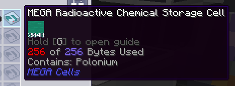

---
navigation:
  title: Радиоактивная химическая ячейка (эксклюзив AppMek)
  icon: radioactive_chemical_cell
  parent: index.md
  position: 050
categories:
  - megacells
item_ids:
  - radioactive_cell_component
  - radioactive_chemical_cell
---

# Ячейки MEGA: Радиоактивная химическая ячейка

В рамках своей широкой кросс-аддонной интеграции, MEGA предлагает вторую специализированную ячейку, эксклюзивную для игроков, также использующих
*Mekanism* и аддон ***Applied Mekanistics***. Если вы не используете ни один из них, и рецепты ниже выдают
ошибку, вы можете смело игнорировать эту страницу и притвориться, что этой ячейки не существует.

## Радиоактивная химическая ячейка

<Row>
  <ItemImage id="radioactive_cell_component" scale="3" />
  <ItemImage id="radioactive_chemical_cell" scale="3" />
</Row>

**Радиоактивная химическая ячейка MEGA**, как следует из названия, служит дополнением к обычным ячейкам хранения,
предлагаемым *Applied Mekanistics* (и собственной интеграцией MEGA с ним), для хранения "химикатов" *Mekanism*. Обычно,
при использовании обычных химических ячеек, можно заметить, что у них есть одно ограничение: они не будут хранить никакие
*радиоактивные* химикаты, к которым в самом Mekanism в основном относятся *Nuclear Waste*, *Polonium* и *Plutonium*.
Радиоактивная ячейка, конечно же, хранит только вышеупомянутые химикаты.

<Row>
  <RecipeFor id="radioactive_cell_component" />
  <RecipeFor id="radioactive_chemical_cell" />
</Row>

Радиоактивная ячейка не слишком отличается от <ItemLink id="megacells:bulk_item_cell" /> тем, что она может хранить
только один заданный тип радиоактивного химиката, и ее необходимо разбить на разделы, прежде чем она сможет работать.
Однако на этом сходство между ними заканчивается; Радиоактивная ячейка хранит лишь конечное количество этого химиката,
максимум *256 [байтов](ae2:ae2-mechanics/bytes-and-types.md)*. Это, однако, эквивалентно *2048 ведрам* — или объему 4
бочек *Nuclear Waste* этого радиоактивного химиката — в пространстве одной ячейки.

Чтобы содержать и хранить такие летучие вещества, ячейка требует значительно больше энергии, чтобы (каким-то образом!)
поддерживать их в относительно стабильном состоянии. По сравнению с типичным потреблением энергии в 0.5 AE/тик для
<ItemLink id="ae2:item_storage_cell_1k" />, 2.5 AE/т для <ItemLink id="ae2:item_storage_cell_256k" /> и 5 AE/т
для <ItemLink id="megacells:item_storage_cell_256m" />, одна Радиоактивная ячейка потребляет колоссальные **250 AE/тик**
находясь в подключенном ME Chest/Drive.

Наконец, чтобы побудить игроков Mekanism продолжать надлежащим образом управлять своими ядерными отходами, как это
задумано, Радиоактивная ячейка по-прежнему явно запрещает хранение ***отработанных** Nuclear Waste* внутри нее.
*По умолчанию* вы не сможете так легко отделаться от необходимости контролировать свои ядерные реакторные станции.
Однако для игроков, которые все же хотят пойти по легкому пути, это поведение можно настроить. *Как* настраивается это
поведение, остается на усмотрение читателя.